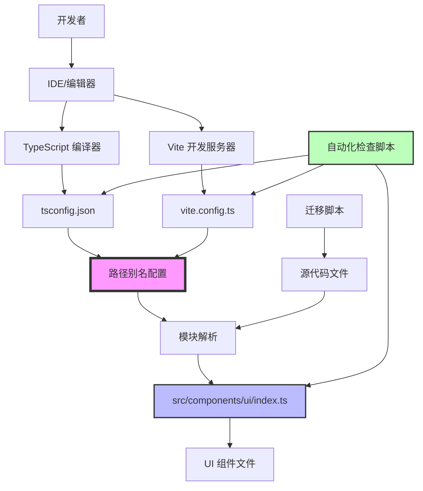

# 设计文档：前端 Import 优化

## 概述

本设计文档描述了如何系统性地解决 CloudFlow Pro 前端项目中的模块导入问题。核心策略包括：统一路径别名配置、创建组件索引文件、建立自动化检查工具、提供迁移脚本。

### 问题根因分析

当前项目存在以下根本问题：

1. **配置不一致**：`tsconfig.json` 中 `@/*` 映射到 `./`（项目根目录），而 `vite.config.ts` 中映射到 `src/`，导致 TypeScript 类型检查失败
2. **缺少统一导出**：UI 组件目录没有 `index.ts`，每个页面都需要单独导入每个组件
3. **依赖项未验证**：某些组件依赖的第三方库（如 @radix-ui）可能未安装或版本不匹配
4. **缺乏规范**：团队没有统一的 import 使用标准，导致代码风格不一致

### 设计目标

- 修复路径别名配置，确保 TypeScript 和 Vite 行为一致
- 创建组件索引文件，简化导入语句
- 提供自动化工具检测和修复问题
- 建立清晰的最佳实践指南
- 确保类型安全和 IDE 智能提示正常工作

## 架构

### 系统组件关系



### 配置层次结构

```
项目根目录/
├── tsconfig.json          # TypeScript 配置（类型检查）
├── vite.config.ts         # Vite 配置（构建和开发服务器）
├── package.json           # 依赖声明
├── .eslintrc.js          # ESLint 规则（可选）
└── src/
    ├── components/
    │   └── ui/
    │       ├── index.ts   # 统一导出文件（新增）
    │       ├── button.tsx
    │       ├── label.tsx
    │       └── input.tsx
    └── pages/
        └── example.tsx    # 使用简化的 import
```

## 组件和接口

### 1. 路径别名配置模块

#### tsconfig.json 配置

```json
{
  "compilerOptions": {
    "baseUrl": ".",
    "paths": {
      "@/*": ["./src/*"]
    },
    "types": ["vite/client"]
  },
  "include": ["src/**/*"],
  "exclude": ["node_modules"]
}
```

**关键点**：
- `baseUrl` 设置为 `.`（项目根目录）
- `paths` 中 `@/*` 映射到 `./src/*`（注意 `src` 前缀）
- 包含 `vite/client` 类型以支持 Vite 特性

#### vite.config.ts 配置

```typescript
import { defineConfig } from 'vite'
import react from '@vitejs/plugin-react'
import path from 'path'

export default defineConfig({
  plugins: [react()],
  resolve: {
    alias: {
      '@': path.resolve(__dirname, './src')
    }
  }
})
```

**关键点**：
- 使用 `path.resolve` 确保绝对路径
- 别名 `@` 指向 `src` 目录（与 tsconfig 一致）

### 2. 组件索引文件

#### src/components/ui/index.ts

```typescript
/**
 * UI 组件统一导出文件
 * 
 * 使用方式：
 * import { Button, Label, Input } from '@/components/ui'
 */

// 基础组件
export { Button } from './button'
export type { ButtonProps } from './button'

export { Label } from './label'
export type { LabelProps } from './label'

export { Input } from './input'
export type { InputProps } from './input'

// 表单组件
export { Checkbox } from './checkbox'
export type { CheckboxProps } from './checkbox'

export { Select, SelectTrigger, SelectContent, SelectItem } from './select'
export type { SelectProps } from './select'

// 反馈组件
export { Toast, ToastProvider, ToastViewport } from './toast'
export type { ToastProps } from './toast'

// ... 其他组件导出
```

**设计原则**：
- 使用命名导出（named export），不使用默认导出
- 同时导出组件和类型定义
- 按功能分组（基础、表单、反馈等）
- 添加清晰的注释说明使用方式

### 3. 自动化检查脚本

#### scripts/check-imports.ts

```typescript
/**
 * Import 配置检查脚本
 * 
 * 功能：
 * 1. 检查 tsconfig.json 和 vite.config.ts 路径别名一致性
 * 2. 验证所有 UI 组件是否在 index.ts 中导出
 * 3. 检测缺失的依赖项
 */

import fs from 'fs'
import path from 'path'
import { glob } from 'glob'

interface CheckResult {
  success: boolean
  errors: string[]
  warnings: string[]
}

/**
 * 检查路径别名配置一致性
 */
function checkPathAliasConsistency(): CheckResult {
  const result: CheckResult = {
    success: true,
    errors: [],
    warnings: []
  }

  // 读取 tsconfig.json
  const tsconfigPath = path.resolve(process.cwd(), 'tsconfig.json')
  const tsconfig = JSON.parse(fs.readFileSync(tsconfigPath, 'utf-8'))
  const tsPaths = tsconfig.compilerOptions?.paths || {}

  // 读取 vite.config.ts（简化版，实际需要解析 TS）
  const viteConfigPath = path.resolve(process.cwd(), 'vite.config.ts')
  const viteConfigContent = fs.readFileSync(viteConfigPath, 'utf-8')
  
  // 检查 tsconfig 中的 @ 别名
  const tsAliasPattern = tsPaths['@/*']
  if (!tsAliasPattern || tsAliasPattern[0] !== './src/*') {
    result.success = false
    result.errors.push(
      `tsconfig.json: @/* 应该映射到 "./src/*"，当前为 "${tsAliasPattern?.[0] || '未定义'}"`
    )
  }

  // 检查 vite.config.ts 中的 @ 别名
  const viteAliasMatch = viteConfigContent.match(/'@':\s*path\.resolve\(__dirname,\s*['"]\.\/src['"]\)/)
  if (!viteAliasMatch) {
    result.success = false
    result.errors.push(
      `vite.config.ts: @ 别名应该指向 './src' 目录`
    )
  }

  return result
}

/**
 * 检查组件索引文件完整性
 */
function checkComponentIndex(): CheckResult {
  const result: CheckResult = {
    success: true,
    errors: [],
    warnings: []
  }

  const uiDir = path.resolve(process.cwd(), 'src/components/ui')
  const indexPath = path.join(uiDir, 'index.ts')

  // 检查 index.ts 是否存在
  if (!fs.existsSync(indexPath)) {
    result.success = false
    result.errors.push(`缺少组件索引文件: ${indexPath}`)
    return result
  }

  // 读取 index.ts 内容
  const indexContent = fs.readFileSync(indexPath, 'utf-8')

  // 获取所有组件文件
  const componentFiles = fs.readdirSync(uiDir)
    .filter(file => file.endsWith('.tsx') && file !== 'index.tsx')
    .map(file => file.replace('.tsx', ''))

  // 检查每个组件是否被导出
  for (const component of componentFiles) {
    const exportPattern = new RegExp(`export.*from\\s+['"]\\.\\/${component}['"]`)
    if (!exportPattern.test(indexContent)) {
      result.warnings.push(
        `组件 "${component}" 未在 index.ts 中导出`
      )
    }
  }

  return result
}

/**
 * 检查依赖项
 */
function checkDependencies(): CheckResult {
  const result: CheckResult = {
    success: true,
    errors: [],
    warnings: []
  }

  const packageJsonPath = path.resolve(process.cwd(), 'package.json')
  const packageJson = JSON.parse(fs.readFileSync(packageJsonPath, 'utf-8'))
  const dependencies = {
    ...packageJson.dependencies,
    ...packageJson.devDependencies
  }

  // 常见的 UI 组件依赖
  const requiredDeps = [
    '@radix-ui/react-label',
    '@radix-ui/react-slot',
    'class-variance-authority',
    'clsx',
    'tailwind-merge'
  ]

  for (const dep of requiredDeps) {
    if (!dependencies[dep]) {
      result.warnings.push(`建议安装依赖: ${dep}`)
    }
  }

  return result
}

/**
 * 主函数
 */
function main() {
  console.log('🔍 开始检查 Import 配置...\n')

  const checks = [
    { name: '路径别名一致性', fn: checkPathAliasConsistency },
    { name: '组件索引完整性', fn: checkComponentIndex },
    { name: '依赖项检查', fn: checkDependencies }
  ]

  let hasErrors = false

  for (const check of checks) {
    console.log(`📋 检查: ${check.name}`)
    const result = check.fn()

    if (result.errors.length > 0) {
      hasErrors = true
      console.log('  ❌ 错误:')
      result.errors.forEach(err => console.log(`     - ${err}`))
    }

    if (result.warnings.length > 0) {
      console.log('  ⚠️  警告:')
      result.warnings.forEach(warn => console.log(`     - ${warn}`))
    }

    if (result.success && result.errors.length === 0 && result.warnings.length === 0) {
      console.log('  ✅ 通过')
    }

    console.log()
  }

  if (hasErrors) {
    console.log('❌ 检查失败，请修复上述错误')
    process.exit(1)
  } else {
    console.log('✅ 所有检查通过')
  }
}

main()
```

### 4. 迁移脚本

#### scripts/migrate-imports.ts

```typescript
/**
 * Import 语句迁移脚本
 * 
 * 功能：
 * 1. 扫描所有源文件
 * 2. 将分散的 UI 组件导入合并为单行
 * 3. 生成迁移报告
 */

import fs from 'fs'
import path from 'path'
import { glob } from 'glob'

interface MigrationResult {
  file: string
  before: string[]
  after: string[]
  changed: boolean
}

/**
 * 解析文件中的 import 语句
 */
function parseImports(content: string): {
  uiImports: Set<string>
  otherImports: string[]
  restContent: string
} {
  const lines = content.split('\n')
  const uiImports = new Set<string>()
  const otherImports: string[] = []
  let inImportSection = true
  const restLines: string[] = []

  for (const line of lines) {
    const trimmed = line.trim()

    // 检测是否是 UI 组件导入
    const uiImportMatch = trimmed.match(/^import\s+\{([^}]+)\}\s+from\s+['"]@\/components\/ui\/(\w+)['"]/)
    
    if (uiImportMatch) {
      // 提取组件名
      const components = uiImportMatch[1].split(',').map(c => c.trim())
      components.forEach(comp => uiImports.add(comp))
      continue
    }

    // 其他 import 语句
    if (trimmed.startsWith('import ') && inImportSection) {
      otherImports.push(line)
      continue
    }

    // 非 import 语句，标记 import 区域结束
    if (trimmed && !trimmed.startsWith('import ')) {
      inImportSection = false
    }

    restLines.push(line)
  }

  return {
    uiImports,
    otherImports,
    restContent: restLines.join('\n')
  }
}

/**
 * 生成优化后的 import 语句
 */
function generateOptimizedImports(
  uiImports: Set<string>,
  otherImports: string[]
): string[] {
  const result: string[] = []

  // 添加其他 import
  result.push(...otherImports)

  // 添加合并后的 UI 组件 import
  if (uiImports.size > 0) {
    const components = Array.from(uiImports).sort()
    
    // 如果组件数量较少，使用单行
    if (components.length <= 5) {
      result.push(`import { ${components.join(', ')} } from '@/components/ui'`)
    } else {
      // 组件较多时，使用多行格式
      result.push('import {')
      components.forEach((comp, index) => {
        const comma = index < components.length - 1 ? ',' : ''
        result.push(`  ${comp}${comma}`)
      })
      result.push(`} from '@/components/ui'`)
    }
  }

  return result
}

/**
 * 迁移单个文件
 */
function migrateFile(filePath: string, dryRun: boolean = false): MigrationResult {
  const content = fs.readFileSync(filePath, 'utf-8')
  const { uiImports, otherImports, restContent } = parseImports(content)

  const result: MigrationResult = {
    file: filePath,
    before: [],
    after: [],
    changed: false
  }

  // 如果没有 UI 组件导入，跳过
  if (uiImports.size === 0) {
    return result
  }

  // 生成新的 import 语句
  const newImports = generateOptimizedImports(uiImports, otherImports)
  const newContent = [...newImports, '', restContent].join('\n')

  // 检查是否有变化
  if (content !== newContent) {
    result.changed = true
    result.before = Array.from(uiImports)
    result.after = newImports.filter(line => line.includes('@/components/ui'))

    // 如果不是干运行，写入文件
    if (!dryRun) {
      fs.writeFileSync(filePath, newContent, 'utf-8')
    }
  }

  return result
}

/**
 * 主函数
 */
async function main() {
  const args = process.argv.slice(2)
  const dryRun = args.includes('--dry-run')

  console.log('🚀 开始迁移 Import 语句...')
  if (dryRun) {
    console.log('📋 干运行模式：不会修改文件\n')
  }

  // 查找所有 TypeScript/TSX 文件
  const files = await glob('src/**/*.{ts,tsx}', {
    ignore: ['**/node_modules/**', '**/*.d.ts']
  })

  console.log(`📁 找到 ${files.length} 个文件\n`)

  const results: MigrationResult[] = []
  let changedCount = 0

  for (const file of files) {
    const result = migrateFile(file, dryRun)
    if (result.changed) {
      results.push(result)
      changedCount++
      console.log(`✏️  ${file}`)
      console.log(`   之前: ${result.before.length} 个分散的导入`)
      console.log(`   之后: 合并为统一导入`)
    }
  }

  console.log(`\n✅ 迁移完成`)
  console.log(`   总文件数: ${files.length}`)
  console.log(`   修改文件数: ${changedCount}`)

  if (dryRun && changedCount > 0) {
    console.log(`\n💡 运行 'npm run migrate-imports' 应用这些更改`)
  }
}

main().catch(console.error)
```

## 数据模型

### 配置文件结构

#### TypeScript 配置模型

```typescript
interface TSConfig {
  compilerOptions: {
    baseUrl: string              // 基础路径，通常为 "."
    paths: Record<string, string[]>  // 路径映射，如 { "@/*": ["./src/*"] }
    types?: string[]             // 类型声明，如 ["vite/client"]
  }
  include: string[]              // 包含的文件模式
  exclude: string[]              // 排除的文件模式
}
```

#### Vite 配置模型

```typescript
interface ViteConfig {
  resolve: {
    alias: Record<string, string>  // 别名映射，如 { "@": "/absolute/path/to/src" }
  }
  plugins: Plugin[]              // Vite 插件
}
```

### 组件导出模型

```typescript
/**
 * 组件导出信息
 */
interface ComponentExport {
  name: string                   // 组件名称，如 "Button"
  filePath: string               // 文件路径，如 "./button"
  hasTypeExport: boolean         // 是否导出类型定义
  typeName?: string              // 类型名称，如 "ButtonProps"
}

/**
 * 组件索引文件结构
 */
interface ComponentIndex {
  exports: ComponentExport[]     // 所有导出的组件
  groups?: {                     // 可选的分组信息
    name: string                 // 分组名称，如 "基础组件"
    components: string[]         // 该组中的组件名称
  }[]
}
```

### 检查结果模型

```typescript
/**
 * 检查结果
 */
interface CheckResult {
  success: boolean               // 是否通过检查
  errors: string[]               // 错误列表
  warnings: string[]             // 警告列表
}

/**
 * 迁移结果
 */
interface MigrationResult {
  file: string                   // 文件路径
  before: string[]               // 迁移前的导入语句
  after: string[]                // 迁移后的导入语句
  changed: boolean               // 是否有变化
}
```


## 正确性属性

*属性是一个特征或行为，应该在系统的所有有效执行中保持为真——本质上是关于系统应该做什么的形式化陈述。属性作为人类可读规范和机器可验证正确性保证之间的桥梁。*

### 属性 1：配置一致性

*对于任意* 项目配置，tsconfig.json 中的 `@/*` 路径映射应该指向 `./src/*`，并且 vite.config.ts 中的 `@` 别名应该解析到项目根目录下的 `src/` 目录，两者的实际解析结果必须指向同一个物理目录。

**验证：需求 1.1, 1.2**

**测试方法**：
- 读取并解析 tsconfig.json 和 vite.config.ts
- 解析路径映射配置
- 将相对路径转换为绝对路径
- 比较两个配置的最终解析路径是否相同

### 属性 2：组件导出完整性

*对于任意* UI 组件目录，index.ts 文件应该导出该目录下所有的组件文件（排除 index.ts 自身），不应该有任何组件文件被遗漏。

**验证：需求 2.2**

**测试方法**：
- 扫描 src/components/ui 目录下所有 .tsx 文件
- 解析 index.ts 的导出语句
- 验证每个组件文件都有对应的导出语句

### 属性 3：命名导出风格

*对于任意* 组件索引文件中的导出语句，所有导出都应该使用命名导出（`export { Component } from './file'`）格式，而不应该使用默认导出（`export default`）。

**验证：需求 2.5**

**测试方法**：
- 解析 index.ts 文件的 AST
- 检查所有导出节点的类型
- 确认没有 ExportDefaultDeclaration 节点
- 确认所有导出都是 ExportNamedDeclaration 类型

### 属性 4：依赖完整性

*对于任意* 源代码文件中导入的外部依赖（非相对路径、非路径别名的导入），该依赖必须在 package.json 的 dependencies 或 devDependencies 中声明。

**验证：需求 3.1**

**测试方法**：
- 扫描所有源文件的 import 语句
- 提取外部包名（不以 . 或 @ 开头的，或以 @ 开头但不是路径别名的）
- 读取 package.json
- 验证所有外部包都在依赖列表中

### 属性 5：Import 行数限制

*对于任意* 源代码文件，如果其 import 语句区域超过 15 行，应该触发警告，提示开发者考虑重构或使用统一导出。

**验证：需求 4.2**

**测试方法**：
- 解析文件内容
- 统计连续的 import 语句行数
- 如果超过阈值，生成警告

### 属性 6：导入路径一致性

*对于任意* 在多个文件中被导入的同一个模块，所有导入语句使用的路径应该一致（都使用路径别名或都使用相对路径，且路径字符串相同）。

**验证：需求 4.3**

**测试方法**：
- 扫描所有源文件的 import 语句
- 按照被导入的模块分组
- 检查每组中的导入路径是否完全一致
- 报告不一致的情况

### 属性 7：导入合并功能

*对于任意* 包含多个从 `@/components/ui/[component]` 导入的文件，迁移脚本应该能够将这些分散的导入合并为单个从 `@/components/ui` 的导入语句。

**验证：需求 7.2**

**测试方法**：
- 创建包含多个分散 UI 组件导入的测试文件
- 运行迁移脚本
- 验证输出文件只包含一个从 `@/components/ui` 的导入
- 验证所有组件都被正确包含在合并后的导入中

### 属性 8：迁移不变性（关键属性）

*对于任意* 源代码文件，在迁移脚本执行前后，文件的语义和功能应该保持完全一致——即导入的组件集合相同，只是导入语句的形式发生了变化。

**验证：需求 7.3**

**测试方法**：
- 解析迁移前文件，提取所有导入的组件名称集合
- 运行迁移脚本
- 解析迁移后文件，提取所有导入的组件名称集合
- 验证两个集合完全相同（使用集合相等性比较）
- 可选：运行测试套件验证功能未受影响

### 属性 9：类型信息保留

*对于任意* 通过 index.ts 重新导出的组件，其类型信息（Props 类型、泛型参数等）应该完全保留，使用该组件的代码应该能够获得与直接导入相同的类型检查和智能提示。

**验证：需求 8.4**

**测试方法**：
- 创建测试文件，分别使用直接导入和通过 index.ts 导入同一组件
- 运行 TypeScript 编译器的类型检查
- 验证两种方式都能正确推断类型
- 验证类型错误在两种方式下都能被正确检测

## 错误处理

### 配置错误处理

**场景 1：路径别名配置缺失**
- **检测**：检查脚本读取配置文件时发现 paths 或 alias 字段不存在
- **处理**：输出清晰的错误信息，说明缺少哪个配置项，并提供修复建议
- **示例错误信息**：
  ```
  ❌ 错误：tsconfig.json 中缺少 compilerOptions.paths 配置
  
  建议修复：
  {
    "compilerOptions": {
      "baseUrl": ".",
      "paths": {
        "@/*": ["./src/*"]
      }
    }
  }
  ```

**场景 2：路径别名配置不一致**
- **检测**：检查脚本发现 tsconfig 和 vite 配置指向不同目录
- **处理**：输出差异对比，提供自动修复选项
- **示例错误信息**：
  ```
  ❌ 错误：路径别名配置不一致
  
  tsconfig.json:  @/* -> ./
  vite.config.ts: @  -> ./src
  
  运行 'npm run fix-config' 自动修复
  ```

**场景 3：配置文件格式错误**
- **检测**：JSON 解析失败或 TypeScript 文件语法错误
- **处理**：捕获解析异常，输出文件位置和错误详情
- **恢复策略**：跳过该文件，继续检查其他配置

### 组件导出错误处理

**场景 4：组件文件不存在**
- **检测**：index.ts 导出了不存在的组件文件
- **处理**：警告开发者，列出所有无效的导出
- **示例警告信息**：
  ```
  ⚠️  警告：以下组件文件不存在
     - ./nonexistent-component (在 index.ts 第 15 行)
  
  建议：移除无效的导出语句或创建缺失的组件文件
  ```

**场景 5：组件未导出**
- **检测**：扫描发现组件文件存在但未在 index.ts 中导出
- **处理**：列出未导出的组件，提供自动添加选项
- **自动修复**：在 index.ts 末尾添加导出语句

### 依赖错误处理

**场景 6：缺失依赖**
- **检测**：源代码导入了未在 package.json 中声明的包
- **处理**：列出所有缺失的依赖，提供安装命令
- **示例错误信息**：
  ```
  ❌ 错误：检测到缺失的依赖项
  
  缺失的包：
    - @radix-ui/react-label (在 3 个文件中使用)
    - class-variance-authority (在 5 个文件中使用)
  
  运行以下命令安装：
  npm install @radix-ui/react-label class-variance-authority
  ```

**场景 7：版本冲突**
- **检测**：不同组件依赖同一包的不同版本
- **处理**：警告可能的版本冲突，建议统一版本
- **恢复策略**：使用 package.json 中声明的版本

### 迁移错误处理

**场景 8：无法解析的导入语句**
- **检测**：迁移脚本遇到复杂的动态导入或非标准语法
- **处理**：记录警告，跳过该文件，不做修改
- **示例警告信息**：
  ```
  ⚠️  警告：无法自动处理以下文件
     - src/pages/complex.tsx (包含动态导入)
  
  建议：手动检查并更新该文件
  ```

**场景 9：文件写入失败**
- **检测**：迁移脚本尝试写入文件时遇到权限错误或磁盘空间不足
- **处理**：捕获异常，回滚已修改的文件，输出错误详情
- **恢复策略**：从备份恢复原始文件

**场景 10：备份失败**
- **检测**：迁移前创建备份时失败
- **处理**：立即终止迁移过程，不修改任何文件
- **示例错误信息**：
  ```
  ❌ 错误：无法创建备份
  
  原因：磁盘空间不足
  
  迁移已取消，未修改任何文件
  ```

### 类型检查错误处理

**场景 11：类型解析失败**
- **检测**：TypeScript 编译器无法解析通过路径别名导入的模块
- **处理**：输出详细的类型错误信息，检查配置是否正确
- **诊断步骤**：
  1. 验证 tsconfig.json 配置
  2. 检查文件是否存在
  3. 验证 index.ts 导出是否正确
  4. 检查是否需要重启 TypeScript 服务器

**场景 12：类型信息丢失**
- **检测**：通过 index.ts 导入的组件失去了类型信息
- **处理**：检查 index.ts 是否正确导出了类型定义
- **修复建议**：确保使用 `export type { ComponentProps }` 导出类型

### 通用错误处理原则

1. **早期失败**：在检测到严重错误时立即停止，避免造成更大问题
2. **清晰的错误信息**：提供上下文、原因和修复建议
3. **自动恢复**：在可能的情况下提供自动修复选项
4. **备份机制**：在修改文件前创建备份，支持回滚
5. **日志记录**：记录所有错误和警告，便于调试
6. **渐进式处理**：即使部分文件失败，也继续处理其他文件

## 测试策略

### 双重测试方法

本项目采用**单元测试**和**基于属性的测试**相结合的策略：

- **单元测试**：验证特定示例、边缘情况和错误条件
- **基于属性的测试**：验证跨所有输入的通用属性

两者是互补的，都是全面覆盖所必需的。

### 单元测试策略

单元测试应该专注于：
- **特定示例**：展示正确行为的具体案例
- **集成点**：组件之间的交互
- **边缘情况和错误条件**：异常情况的处理

**避免过多的单元测试** - 基于属性的测试已经处理了大量输入的覆盖。

#### 单元测试用例

**配置解析测试**：
```typescript
describe('配置解析', () => {
  it('应该正确解析 tsconfig.json 中的路径别名', () => {
    const config = parseTSConfig('./fixtures/tsconfig.json')
    expect(config.paths['@/*']).toEqual(['./src/*'])
  })

  it('应该正确解析 vite.config.ts 中的别名', () => {
    const config = parseViteConfig('./fixtures/vite.config.ts')
    expect(config.alias['@']).toContain('/src')
  })

  it('应该处理缺失的配置字段', () => {
    const config = parseTSConfig('./fixtures/incomplete-tsconfig.json')
    expect(config.paths).toBeUndefined()
  })
})
```

**组件索引测试**：
```typescript
describe('组件索引', () => {
  it('应该检测到缺失的组件导出', () => {
    const result = checkComponentIndex('./fixtures/incomplete-index')
    expect(result.warnings).toContain('组件 "missing-button" 未在 index.ts 中导出')
  })

  it('应该验证所有组件都已导出', () => {
    const result = checkComponentIndex('./fixtures/complete-index')
    expect(result.success).toBe(true)
    expect(result.warnings).toHaveLength(0)
  })
})
```

**迁移脚本测试**：
```typescript
describe('迁移脚本', () => {
  it('应该合并分散的 UI 组件导入', () => {
    const input = `
      import { Button } from '@/components/ui/button'
      import { Label } from '@/components/ui/label'
    `
    const output = migrateImports(input)
    expect(output).toContain("import { Button, Label } from '@/components/ui'")
  })

  it('应该保留非 UI 组件的导入', () => {
    const input = `
      import React from 'react'
      import { Button } from '@/components/ui/button'
    `
    const output = migrateImports(input)
    expect(output).toContain("import React from 'react'")
  })

  it('应该在干运行模式下不修改文件', () => {
    const filePath = './fixtures/test-file.tsx'
    const originalContent = fs.readFileSync(filePath, 'utf-8')
    migrateFile(filePath, true) // dry-run
    const currentContent = fs.readFileSync(filePath, 'utf-8')
    expect(currentContent).toBe(originalContent)
  })
})
```

### 基于属性的测试策略

基于属性的测试应该专注于：
- **通用属性**：对所有输入都成立的规则
- **通过随机化实现全面的输入覆盖**

#### 属性测试配置

- **测试库**：使用 `fast-check`（JavaScript/TypeScript 的属性测试库）
- **最小迭代次数**：每个属性测试至少 100 次迭代
- **标签格式**：`Feature: frontend-import-optimization, Property {number}: {property_text}`

#### 属性测试用例

**属性 1：配置一致性**
```typescript
import fc from 'fast-check'

// Feature: frontend-import-optimization, Property 1: 配置一致性
describe('属性测试：配置一致性', () => {
  it('tsconfig 和 vite 配置应该解析到相同的目录', () => {
    fc.assert(
      fc.property(
        fc.record({
          tsconfig: fc.constant({ paths: { '@/*': ['./src/*'] } }),
          viteConfig: fc.constant({ alias: { '@': './src' } })
        }),
        (configs) => {
          const tsPath = resolveTSConfigPath(configs.tsconfig, '@/components')
          const vitePath = resolveViteConfigPath(configs.viteConfig, '@/components')
          return path.normalize(tsPath) === path.normalize(vitePath)
        }
      ),
      { numRuns: 100 }
    )
  })
})
```

**属性 2：组件导出完整性**
```typescript
// Feature: frontend-import-optimization, Property 2: 组件导出完整性
describe('属性测试：组件导出完整性', () => {
  it('index.ts 应该导出目录下所有组件', () => {
    fc.assert(
      fc.property(
        // 生成随机的组件文件列表
        fc.array(fc.string({ minLength: 1, maxLength: 20 }), { minLength: 1, maxLength: 10 }),
        (componentNames) => {
          // 创建临时测试目录
          const testDir = createTempComponentDir(componentNames)
          
          // 生成 index.ts
          generateComponentIndex(testDir)
          
          // 验证所有组件都被导出
          const indexContent = fs.readFileSync(path.join(testDir, 'index.ts'), 'utf-8')
          const allExported = componentNames.every(name => 
            indexContent.includes(`export { ${capitalize(name)} } from './${name}'`)
          )
          
          // 清理
          cleanupTempDir(testDir)
          
          return allExported
        }
      ),
      { numRuns: 100 }
    )
  })
})
```

**属性 8：迁移不变性（最关键）**
```typescript
// Feature: frontend-import-optimization, Property 8: 迁移不变性
describe('属性测试：迁移不变性', () => {
  it('迁移前后导入的组件集合应该完全相同', () => {
    fc.assert(
      fc.property(
        // 生成随机的 UI 组件导入列表
        fc.array(
          fc.constantFrom('Button', 'Label', 'Input', 'Checkbox', 'Select'),
          { minLength: 1, maxLength: 10 }
        ),
        (components) => {
          // 生成包含分散导入的测试文件
          const originalContent = generateFileWithScatteredImports(components)
          
          // 解析原始导入
          const originalImports = parseImportedComponents(originalContent)
          
          // 执行迁移
          const migratedContent = migrateImports(originalContent)
          
          // 解析迁移后的导入
          const migratedImports = parseImportedComponents(migratedContent)
          
          // 验证集合相等
          return (
            originalImports.size === migratedImports.size &&
            [...originalImports].every(comp => migratedImports.has(comp))
          )
        }
      ),
      { numRuns: 100 }
    )
  })
})
```

**属性 9：类型信息保留**
```typescript
// Feature: frontend-import-optimization, Property 9: 类型信息保留
describe('属性测试：类型信息保留', () => {
  it('通过 index.ts 导入应该保留完整的类型信息', () => {
    fc.assert(
      fc.property(
        fc.constantFrom('Button', 'Label', 'Input'),
        (componentName) => {
          // 创建两个测试文件：一个直接导入，一个通过 index 导入
          const directImportFile = `
            import { ${componentName} } from '@/components/ui/${componentName.toLowerCase()}'
            const test: ${componentName}Props = { /* ... */ }
          `
          
          const indexImportFile = `
            import { ${componentName} } from '@/components/ui'
            const test: ${componentName}Props = { /* ... */ }
          `
          
          // 运行类型检查
          const directResult = runTypeCheck(directImportFile)
          const indexResult = runTypeCheck(indexImportFile)
          
          // 两者应该有相同的类型检查结果
          return directResult.success === indexResult.success
        }
      ),
      { numRuns: 100 }
    )
  })
})
```

### 集成测试

**端到端测试场景**：
1. 创建一个完整的测试项目
2. 运行配置检查脚本
3. 运行迁移脚本
4. 执行 TypeScript 类型检查
5. 运行 Vite 构建
6. 验证所有步骤都成功

### 测试覆盖率目标

- **单元测试覆盖率**：> 80%
- **属性测试覆盖率**：所有 9 个核心属性都有对应的测试
- **集成测试**：至少 1 个完整的端到端场景

### CI/CD 集成

```yaml
# .github/workflows/test.yml
name: 测试

on: [push, pull_request]

jobs:
  test:
    runs-on: ubuntu-latest
    steps:
      - uses: actions/checkout@v3
      - uses: actions/setup-node@v3
        with:
          node-version: '18'
      
      - name: 安装依赖
        run: npm ci
      
      - name: 运行配置检查
        run: npm run check-imports
      
      - name: 运行单元测试
        run: npm test
      
      - name: 运行属性测试
        run: npm run test:property
      
      - name: 类型检查
        run: npm run type-check
      
      - name: 构建测试
        run: npm run build
```

## 实施注意事项

### 渐进式迁移策略

1. **第一阶段：修复配置**（P0）
   - 更新 tsconfig.json 和 vite.config.ts
   - 重启开发服务器
   - 验证类型检查通过

2. **第二阶段：创建组件索引**（P1）
   - 创建 src/components/ui/index.ts
   - 导出所有现有组件
   - 验证导入功能正常

3. **第三阶段：迁移现有代码**（P2）
   - 先在小范围测试迁移脚本
   - 逐步扩大迁移范围
   - 每次迁移后运行测试套件

4. **第四阶段：建立规范和自动化**（P3）
   - 编写最佳实践文档
   - 配置 ESLint 规则
   - 集成到 CI/CD

### 团队协作建议

- **代码审查重点**：检查新的 import 语句是否符合规范
- **培训材料**：准备简短的视频或文档介绍新的导入方式
- **过渡期**：允许旧的导入方式和新方式共存一段时间
- **反馈机制**：收集团队成员的使用反馈，持续改进

### 性能考虑

- **构建性能**：统一导出不会显著影响构建速度（Vite 的 tree-shaking 会移除未使用的导出）
- **开发体验**：路径别名可以提高 IDE 的自动补全速度
- **类型检查**：确保 TypeScript 配置正确，避免不必要的类型检查开销

### 兼容性

- **Node.js 版本**：要求 Node.js >= 16
- **TypeScript 版本**：要求 TypeScript >= 4.5
- **Vite 版本**：要求 Vite >= 3.0
- **浏览器支持**：不影响浏览器兼容性（仅影响开发时配置）
