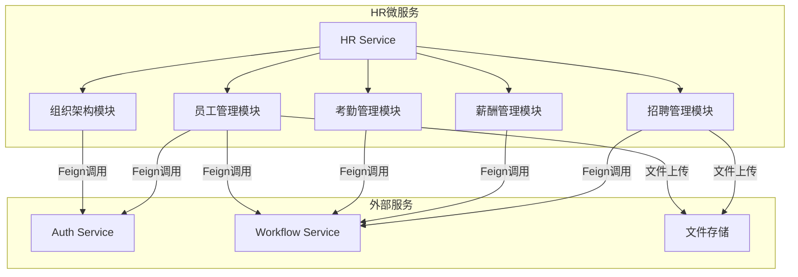

# 设计文档：HR人力资源管理微服务

## 概述

CloudFlow Pro HR微服务（cloudflow-service-hr）是一个企业级人力资源管理系统，采用Spring Cloud微服务架构，提供组织架构、员工全生命周期、考勤管理和薪酬管理等核心功能。

### 设计目标

1. **混合架构**：复用Auth服务的基础组织架构能力，HR服务专注于专业HR功能扩展
2. **服务解耦**：通过Feign客户端与Auth服务、Workflow服务松耦合集成
3. **多租户隔离**：基于tenant_id实现数据隔离，确保不同企业数据安全
4. **审批流程统一**：所有审批流程通过Workflow服务统一处理
5. **数据权限控制**：支持全部数据、本部门及下级、本部门、仅本人四种权限范围
6. **可扩展性**：模块化设计，支持功能模块独立扩展

### 技术栈

- **框架**：Spring Boot 2.7.x + Spring Cloud 2021.x
- **数据库**：MySQL 8.0 + MyBatis-Plus 3.5.x
- **缓存**：Redis 6.x
- **服务调用**：OpenFeign
- **消息队列**：RabbitMQ（用于数据同步）
- **文件存储**：MinIO / 阿里云OSS
- **认证鉴权**：JWT + Spring Security

## 架构设计

### 系统架构图



### 模块职责划分

#### 组织架构模块（Organization Module）
- **复用Auth服务**：部门基础信息、岗位基础信息、用户岗位关联
- **HR服务扩展**：职位族、职级体系、职位管理、编制管理、汇报关系、职位描述
- **数据同步**：通过Feign调用Auth服务，维护dept_id和post_id外键关联

#### 员工管理模块（Employee Module）
- 员工档案管理（基础信息、合同信息、证件信息、紧急联系人）
- 员工生命周期管理（入职、转正、调岗、离职）
- 招聘管理（招聘需求、候选人、面试、Offer）
- 与Auth服务集成（账号创建、信息同步、账号注销）

#### 考勤管理模块（Attendance Module）
- 排班规则管理（班次、排班计划、排班模板）
- 打卡管理（GPS打卡、WiFi打卡、人脸识别打卡、补卡）
- 假期管理（假期类型、假期额度、请假审批）
- 加班管理（加班申请、加班审批、调休转换）
- 考勤统计（月度汇总、异常统计、出勤率分析）

#### 薪酬管理模块（Salary Module）
- 薪资结构配置（薪资项目、薪资结构、薪资等级表）
- 调薪管理（调薪申请、调薪审批、调薪历史）
- 五险一金配置（缴纳方案、缴纳基数、城市政策）
- 个税配置（起征点、税率表、专项附加扣除）

### 服务集成设计

#### 与Auth服务集成

**集成方式**：OpenFeign客户端

**接口定义**：
```java
@FeignClient(name = "cloudflow-service-auth", path = "/api/auth")
public interface AuthServiceClient {
    
    // 部门管理接口
    @GetMapping("/dept/tree")
    Result<List<DeptTreeVO>> getDeptTree(@RequestParam Long tenantId);
    
    @GetMapping("/dept/{id}")
    Result<DeptVO> getDeptById(@PathVariable Long id);
    
    @PostMapping("/dept")
    Result<Long> createDept(@RequestBody DeptCreateDTO dto);
    
    // 岗位管理接口
    @GetMapping("/post/list")
    Result<List<PostVO>> getPostList(@RequestParam Long tenantId);
    
    @GetMapping("/post/{id}")
    Result<PostVO> getPostById(@PathVariable Long id);
    
    @PostMapping("/post")
    Result<Long> createPost(@RequestBody PostCreateDTO dto);
    
    // 用户管理接口
    @PostMapping("/user")
    Result<Long> createUser(@RequestBody UserCreateDTO dto);
    
    @PutMapping("/user/{id}")
    Result<Void> updateUser(@PathVariable Long id, @RequestBody UserUpdateDTO dto);
    
    @DeleteMapping("/user/{id}")
    Result<Void> disableUser(@PathVariable Long id);
}
```

**数据同步策略**：
1. **启动时全量同步**：HR服务启动时，从Auth服务拉取全量部门和岗位数据，缓存到Redis
2. **定时增量同步**：每5分钟通过定时任务同步变更数据
3. **消息队列实时同步**：Auth服务数据变更时，通过RabbitMQ发送消息，HR服务监听并更新缓存
4. **失效检测**：HR服务定期检测dept_id和post_id的有效性，标记失效数据

#### 与Workflow服务集成

**集成方式**：OpenFeign客户端 + 回调接口

**接口定义**：
```java
@FeignClient(name = "cloudflow-service-workflow", path = "/api/workflow")
public interface WorkflowServiceClient {
    
    // 启动流程
    @PostMapping("/process/start")
    Result<String> startProcess(@RequestBody ProcessStartDTO dto);
    
    // 查询流程状态
    @GetMapping("/process/{processInstanceId}")
    Result<ProcessInstanceVO> getProcessInstance(@PathVariable String processInstanceId);
    
    // 撤销流程
    @PostMapping("/process/{processInstanceId}/cancel")
    Result<Void> cancelProcess(@PathVariable String processInstanceId);
}
```

**回调接口**：
```java
@RestController
@RequestMapping("/api/hr/callback")
public class WorkflowCallbackController {
    
    // 审批结果回调
    @PostMapping("/approval")
    public Result<Void> handleApprovalResult(@RequestBody ApprovalResultDTO dto) {
        // 根据业务类型分发到不同的处理器
        // 支持的业务类型：入职、转正、调岗、离职、请假、加班、调薪、招聘需求、Offer
    }
}
```

**流程类型定义**：
- `ONBOARDING`：入职审批流程
- `PROBATION_CONFIRMATION`：转正审批流程
- `TRANSFER`：调岗审批流程
- `RESIGNATION`：离职审批流程
- `LEAVE`：请假审批流程
- `OVERTIME`：加班审批流程
- `SALARY_ADJUSTMENT`：调薪审批流程
- `RECRUITMENT_REQUEST`：招聘需求审批流程
- `OFFER`：Offer审批流程
- `ATTENDANCE_SUPPLEMENT`：补卡审批流程

## 组件和接口设计

### 组织架构模块

#### 核心实体

**职位族（Position Family）**
```java
@Data
@TableName("hr_position_family")
public class PositionFamily {
    private Long id;
    private Long tenantId;
    private String familyCode;      // 职位族编码：TECH、PRODUCT、OPERATION等
    private String familyName;      // 职位族名称：技术族、产品族、运营族
    private String description;     // 描述
    private Integer sortOrder;      // 排序
    private Integer status;         // 状态：0-禁用 1-启用
    private LocalDateTime createTime;
    private LocalDateTime updateTime;
}
```

**职级（Job Level）**
```java
@Data
@TableName("hr_job_level")
public class JobLevel {
    private Long id;
    private Long tenantId;
    private String levelCode;       // 职级编码：P1、P2、M1等
    private String levelName;       // 职级名称
    private String levelSeries;     // 职级序列：P（专业）、M（管理）
    private Integer levelRank;      // 职级等级：1-10
    private String description;     // 描述
    private Integer status;         // 状态：0-禁用 1-启用
    private LocalDateTime createTime;
    private LocalDateTime updateTime;
}
```

**职位（Position）**
```java
@Data
@TableName("hr_position")
public class Position {
    private Long id;
    private Long tenantId;
    private String positionCode;    // 职位编码
    private String positionName;    // 职位名称
    private Long familyId;          // 职位族ID
    private Long levelId;           // 职级ID
    private Long postId;            // 岗位ID（关联Auth服务的sys_post）
    private String jobDescription;  // 岗位职责
    private String requirements;    // 任职要求
    private String workContent;     // 工作内容
    private Integer status;         // 状态：0-禁用 1-启用
    private LocalDateTime createTime;
    private LocalDateTime updateTime;
}
```

**编制管理（Headcount）**
```java
@Data
@TableName("hr_headcount")
public class Headcount {
    private Long id;
    private Long tenantId;
    private String targetType;      // 目标类型：DEPT-部门 POST-岗位
    private Long targetId;          // 目标ID（dept_id或post_id）
    private Integer approvedCount;  // 核定编制数
    private Integer actualCount;    // 实际在职人数
    private Integer vacancyCount;   // 空缺人数
    private LocalDateTime effectiveDate; // 生效日期
    private LocalDateTime expiryDate;    // 失效日期
    private LocalDateTime createTime;
    private LocalDateTime updateTime;
}
```

**汇报关系（Reporting Line）**
```java
@Data
@TableName("hr_reporting_line")
public class ReportingLine {
    private Long id;
    private Long tenantId;
    private Long employeeId;        // 员工ID
    private Long reportToId;        // 汇报对象ID
    private String reportType;      // 汇报类型：DIRECT-直接汇报 DOTTED-虚线汇报
    private LocalDateTime effectiveDate; // 生效日期
    private LocalDateTime expiryDate;    // 失效日期
    private LocalDateTime createTime;
    private LocalDateTime updateTime;
}
```


#### 核心接口

**组织架构服务接口**
```java
public interface OrganizationService {
    
    // 职位族管理
    Long createPositionFamily(PositionFamilyCreateDTO dto);
    void updatePositionFamily(Long id, PositionFamilyUpdateDTO dto);
    PositionFamilyVO getPositionFamily(Long id);
    List<PositionFamilyVO> listPositionFamilies();
    
    // 职级管理
    Long createJobLevel(JobLevelCreateDTO dto);
    void updateJobLevel(Long id, JobLevelUpdateDTO dto);
    JobLevelVO getJobLevel(Long id);
    List<JobLevelVO> listJobLevels(String levelSeries);
    
    // 职位管理
    Long createPosition(PositionCreateDTO dto);
    void updatePosition(Long id, PositionUpdateDTO dto);
    PositionDetailVO getPosition(Long id);  // 包含关联的部门、岗位、职位族、职级信息
    List<PositionVO> listPositions(PositionQueryDTO query);
    
    // 编制管理
    void setHeadcount(HeadcountSetDTO dto);
    HeadcountStatisticsVO getHeadcountStatistics(String targetType, Long targetId);
    List<HeadcountVO> listHeadcounts(HeadcountQueryDTO query);
    
    // 汇报关系管理
    void setReportingLine(ReportingLineSetDTO dto);
    List<ReportingLineVO> getReportingLines(Long employeeId);
    ReportingMatrixVO getReportingMatrix(Long deptId);  // 获取部门汇报关系矩阵
}
```

**部门岗位同步服务**
```java
public interface DeptPostSyncService {
    
    // 同步部门数据
    void syncDepartments();
    void syncDepartment(Long deptId);
    
    // 同步岗位数据
    void syncPosts();
    void syncPost(Long postId);
    
    // 验证关联有效性
    boolean validateDeptId(Long deptId);
    boolean validatePostId(Long postId);
    
    // 获取缓存数据
    DeptVO getCachedDept(Long deptId);
    PostVO getCachedPost(Long postId);
    List<DeptVO> getCachedDeptTree();
}
```

### 员工管理模块

#### 核心实体

**员工档案（Employee）**
```java
@Data
@TableName("hr_employee")
public class Employee {
    private Long id;
    private Long tenantId;
    private String employeeNo;      // 工号
    private String name;            // 姓名
    private String gender;          // 性别：MALE-男 FEMALE-女
    private LocalDate birthDate;    // 出生日期
    private String phone;           // 手机号
    private String email;           // 邮箱
    private Long deptId;            // 部门ID（关联Auth服务）
    private Long postId;            // 岗位ID（关联Auth服务）
    private Long positionId;        // 职位ID（HR服务）
    private String employeeType;    // 员工类型：FULL_TIME-全职 PART_TIME-兼职 INTERN-实习生 CONTRACTOR-外包
    private String employeeStatus;  // 员工状态：PENDING-待入职 PROBATION-试用期 REGULAR-正式 RESIGNED-已离职
    private LocalDate hireDate;     // 入职日期
    private LocalDate regularDate;  // 转正日期
    private LocalDate resignDate;   // 离职日期
    private Long userId;            // 用户ID（关联Auth服务）
    private LocalDateTime createTime;
    private LocalDateTime updateTime;
}
```

**员工合同（Employee Contract）**
```java
@Data
@TableName("hr_employee_contract")
public class EmployeeContract {
    private Long id;
    private Long tenantId;
    private Long employeeId;
    private String contractType;    // 合同类型：LABOR-劳动合同 SERVICE-劳务合同 INTERN-实习协议
    private String contractNo;      // 合同编号
    private LocalDate signDate;     // 签订日期
    private LocalDate startDate;    // 开始日期
    private LocalDate endDate;      // 结束日期
    private Integer duration;       // 合同期限（月）
    private String fileUrl;         // 合同文件URL
    private String status;          // 状态：DRAFT-草稿 ACTIVE-生效中 EXPIRED-已过期 TERMINATED-已终止
    private LocalDateTime createTime;
    private LocalDateTime updateTime;
}
```

**员工证件（Employee Document）**
```java
@Data
@TableName("hr_employee_document")
public class EmployeeDocument {
    private Long id;
    private Long tenantId;
    private Long employeeId;
    private String documentType;    // 证件类型：ID_CARD-身份证 PASSPORT-护照 DIPLOMA-学历证书 DEGREE-学位证书
    private String documentNo;      // 证件号码
    private LocalDate issueDate;    // 签发日期
    private LocalDate expiryDate;   // 有效期至
    private String fileUrl;         // 证件扫描件URL
    private LocalDateTime createTime;
    private LocalDateTime updateTime;
}
```

**紧急联系人（Emergency Contact）**
```java
@Data
@TableName("hr_emergency_contact")
public class EmergencyContact {
    private Long id;
    private Long tenantId;
    private Long employeeId;
    private String contactName;     // 联系人姓名
    private String relationship;    // 关系：SPOUSE-配偶 PARENT-父母 SIBLING-兄弟姐妹 CHILD-子女 OTHER-其他
    private String phone;           // 联系电话
    private String address;         // 联系地址
    private Integer priority;       // 优先级：1-第一联系人 2-第二联系人
    private LocalDateTime createTime;
    private LocalDateTime updateTime;
}
```

**入职申请（Onboarding Application）**
```java
@Data
@TableName("hr_onboarding_application")
public class OnboardingApplication {
    private Long id;
    private Long tenantId;
    private String applicationNo;   // 申请编号
    private Long candidateId;       // 候选人ID（如果来自招聘）
    private String name;            // 姓名
    private String phone;           // 手机号
    private String email;           // 邮箱
    private Long deptId;            // 部门ID
    private Long postId;            // 岗位ID
    private Long positionId;        // 职位ID
    private LocalDate expectedDate; // 预计入职日期
    private String processInstanceId; // 流程实例ID
    private String status;          // 状态：DRAFT-草稿 APPROVING-审批中 APPROVED-已通过 REJECTED-已拒绝 ONBOARDED-已入职
    private Long employeeId;        // 员工ID（入职后生成）
    private LocalDateTime createTime;
    private LocalDateTime updateTime;
}
```

**入职任务（Onboarding Task）**
```java
@Data
@TableName("hr_onboarding_task")
public class OnboardingTask {
    private Long id;
    private Long tenantId;
    private Long applicationId;     // 入职申请ID
    private String taskName;        // 任务名称
    private String taskType;        // 任务类型：DOCUMENT-资料收集 ACCOUNT-账号开通 EQUIPMENT-设备领用 TRAINING-培训
    private String taskDescription; // 任务描述
    private Long assigneeId;        // 负责人ID
    private String status;          // 状态：PENDING-待处理 IN_PROGRESS-处理中 COMPLETED-已完成
    private LocalDateTime completedTime;
    private String remark;          // 备注
    private LocalDateTime createTime;
    private LocalDateTime updateTime;
}
```

**转正申请（Probation Confirmation）**
```java
@Data
@TableName("hr_probation_confirmation")
public class ProbationConfirmation {
    private Long id;
    private Long tenantId;
    private String applicationNo;   // 申请编号
    private Long employeeId;        // 员工ID
    private LocalDate probationStartDate;  // 试用期开始日期
    private LocalDate probationEndDate;    // 试用期结束日期
    private LocalDate expectedRegularDate; // 预计转正日期
    private String selfEvaluation;  // 自我评价
    private String managerEvaluation; // 主管评价
    private String processInstanceId; // 流程实例ID
    private String status;          // 状态：DRAFT-草稿 APPROVING-审批中 APPROVED-已通过 REJECTED-已拒绝 EXTENDED-延长试用期
    private String rejectReason;    // 拒绝原因
    private Integer extensionDays;  // 延长天数
    private LocalDateTime createTime;
    private LocalDateTime updateTime;
}
```

**调岗申请（Transfer Application）**
```java
@Data
@TableName("hr_transfer_application")
public class TransferApplication {
    private Long id;
    private Long tenantId;
    private String applicationNo;   // 申请编号
    private Long employeeId;        // 员工ID
    private Long fromDeptId;        // 原部门ID
    private Long fromPostId;        // 原岗位ID
    private Long fromPositionId;    // 原职位ID
    private Long toDeptId;          // 目标部门ID
    private Long toPostId;          // 目标岗位ID
    private Long toPositionId;      // 目标职位ID
    private String transferType;    // 调岗类型：DEPT-部门调动 POST-岗位调整 PROMOTION-晋升 DEMOTION-降级
    private String reason;          // 调岗原因
    private LocalDate effectiveDate; // 生效日期
    private Boolean salaryChange;   // 是否涉及薪资变更
    private String processInstanceId; // 流程实例ID
    private String status;          // 状态：DRAFT-草稿 APPROVING-审批中 APPROVED-已通过 REJECTED-已拒绝 EFFECTIVE-已生效
    private LocalDateTime createTime;
    private LocalDateTime updateTime;
}
```

**离职申请（Resignation Application）**
```java
@Data
@TableName("hr_resignation_application")
public class ResignationApplication {
    private Long id;
    private Long tenantId;
    private String applicationNo;   // 申请编号
    private Long employeeId;        // 员工ID
    private String resignationType; // 离职类型：VOLUNTARY-主动离职 INVOLUNTARY-被动离职 CONTRACT_EXPIRY-合同到期
    private String resignationReason; // 离职原因
    private LocalDate expectedDate; // 预计离职日期
    private LocalDate actualDate;   // 实际离职日期
    private String interviewContent; // 离职面谈内容
    private String processInstanceId; // 流程实例ID
    private String status;          // 状态：DRAFT-草稿 APPROVING-审批中 APPROVED-已通过 REJECTED-已拒绝 COMPLETED-已完成
    private LocalDateTime createTime;
    private LocalDateTime updateTime;
}
```

**离职交接（Resignation Handover）**
```java
@Data
@TableName("hr_resignation_handover")
public class ResignationHandover {
    private Long id;
    private Long tenantId;
    private Long applicationId;     // 离职申请ID
    private String handoverItem;    // 交接项目
    private String handoverType;    // 交接类型：WORK-工作交接 ASSET-资产归还 DOCUMENT-文档交接 ACCOUNT-账号注销
    private Long handoverToId;      // 交接对象ID
    private String status;          // 状态：PENDING-待交接 COMPLETED-已完成
    private LocalDateTime completedTime;
    private String remark;          // 备注
    private LocalDateTime createTime;
    private LocalDateTime updateTime;
}
```


#### 核心接口

**员工档案服务接口**
```java
public interface EmployeeService {
    
    // 员工档案管理
    Long createEmployee(EmployeeCreateDTO dto);
    void updateEmployee(Long id, EmployeeUpdateDTO dto);
    EmployeeDetailVO getEmployee(Long id);  // 包含部门、岗位、职位、合同、证件等完整信息
    PageResult<EmployeeVO> listEmployees(EmployeeQueryDTO query);
    
    // 合同管理
    Long addContract(EmployeeContractCreateDTO dto);
    void updateContract(Long id, EmployeeContractUpdateDTO dto);
    List<EmployeeContractVO> listContracts(Long employeeId);
    List<EmployeeContractVO> listExpiringContracts(Integer days);  // 查询即将到期的合同
    
    // 证件管理
    Long addDocument(EmployeeDocumentCreateDTO dto);
    void updateDocument(Long id, EmployeeDocumentUpdateDTO dto);
    List<EmployeeDocumentVO> listDocuments(Long employeeId);
    
    // 紧急联系人管理
    Long addEmergencyContact(EmergencyContactCreateDTO dto);
    void updateEmergencyContact(Long id, EmergencyContactUpdateDTO dto);
    List<EmergencyContactVO> listEmergencyContacts(Long employeeId);
}
```

**员工生命周期服务接口**
```java
public interface EmployeeLifecycleService {
    
    // 入职流程
    Long createOnboardingApplication(OnboardingApplicationCreateDTO dto);
    void submitOnboardingApplication(Long id);  // 提交审批
    void approveOnboarding(Long id);  // 审批通过后的处理
    void completeOnboardingTask(Long taskId, String remark);
    void confirmOnboarding(Long id, LocalDate actualDate);  // 确认入职
    
    // 转正流程
    Long createProbationConfirmation(ProbationConfirmationCreateDTO dto);
    void submitProbationConfirmation(Long id);  // 提交审批
    void approveProbationConfirmation(Long id);  // 审批通过后的处理
    void rejectProbationConfirmation(Long id, String reason, Integer extensionDays);
    
    // 调岗流程
    Long createTransferApplication(TransferApplicationCreateDTO dto);
    void submitTransferApplication(Long id);  // 提交审批
    void approveTransfer(Long id);  // 审批通过后的处理
    void effectiveTransfer(Long id);  // 调岗生效
    
    // 离职流程
    Long createResignationApplication(ResignationApplicationCreateDTO dto);
    void submitResignationApplication(Long id);  // 提交审批
    void approveResignation(Long id);  // 审批通过后的处理
    void conductExitInterview(Long id, String interviewContent);  // 离职面谈
    void completeHandover(Long handoverId, String remark);  // 完成交接
    void confirmResignation(Long id, LocalDate actualDate);  // 确认离职
}
```

### 考勤管理模块

#### 核心实体

**班次（Shift）**
```java
@Data
@TableName("hr_shift")
public class Shift {
    private Long id;
    private Long tenantId;
    private String shiftCode;       // 班次编码
    private String shiftName;       // 班次名称
    private LocalTime startTime;    // 上班时间
    private LocalTime endTime;      // 下班时间
    private Integer breakMinutes;   // 休息时长（分钟）
    private Integer lateThreshold;  // 迟到阈值（分钟）
    private Integer earlyThreshold; // 早退阈值（分钟）
    private Integer workMinutes;    // 工作时长（分钟）
    private String color;           // 显示颜色
    private Integer status;         // 状态：0-禁用 1-启用
    private LocalDateTime createTime;
    private LocalDateTime updateTime;
}
```

**排班规则（Schedule Rule）**
```java
@Data
@TableName("hr_schedule_rule")
public class ScheduleRule {
    private Long id;
    private Long tenantId;
    private String ruleName;        // 规则名称
    private String ruleType;        // 规则类型：FIXED-固定班 ROTATION-轮班 FLEXIBLE-弹性工作制 COMPREHENSIVE-综合工时制
    private String ruleConfig;      // 规则配置（JSON格式）
    private String description;     // 描述
    private Integer status;         // 状态：0-禁用 1-启用
    private LocalDateTime createTime;
    private LocalDateTime updateTime;
}
```

**排班计划（Schedule Plan）**
```java
@Data
@TableName("hr_schedule_plan")
public class SchedulePlan {
    private Long id;
    private Long tenantId;
    private String planName;        // 计划名称
    private String targetType;      // 目标类型：EMPLOYEE-员工 DEPT-部门
    private Long targetId;          // 目标ID
    private Long shiftId;           // 班次ID
    private LocalDate scheduleDate; // 排班日期
    private String status;          // 状态：DRAFT-草稿 PUBLISHED-已发布 CANCELLED-已取消
    private LocalDateTime createTime;
    private LocalDateTime updateTime;
}
```

**打卡记录（Attendance Record）**
```java
@Data
@TableName("hr_attendance_record")
public class AttendanceRecord {
    private Long id;
    private Long tenantId;
    private Long employeeId;        // 员工ID
    private LocalDate attendanceDate; // 考勤日期
    private Long shiftId;           // 班次ID
    private String checkType;       // 打卡类型：CHECK_IN-上班打卡 CHECK_OUT-下班打卡
    private LocalDateTime checkTime; // 打卡时间
    private String checkMethod;     // 打卡方式：GPS-定位打卡 WIFI-WiFi打卡 FACE-人脸识别
    private String location;        // 打卡位置（GPS坐标或WiFi SSID）
    private String status;          // 状态：NORMAL-正常 LATE-迟到 EARLY-早退 MISSING-缺卡 SUPPLEMENT-补卡
    private String processInstanceId; // 补卡流程实例ID
    private String remark;          // 备注
    private LocalDateTime createTime;
}
```

**假期类型（Leave Type）**
```java
@Data
@TableName("hr_leave_type")
public class LeaveType {
    private Long id;
    private Long tenantId;
    private String leaveCode;       // 假期编码
    private String leaveName;       // 假期名称
    private Boolean needQuota;      // 是否需要额度
    private Boolean isPaid;         // 是否带薪
    private String unit;            // 计算单位：DAY-天 HOUR-小时
    private String quotaRule;       // 额度规则（JSON格式）
    private String expiryRule;      // 过期规则（JSON格式）
    private Integer status;         // 状态：0-禁用 1-启用
    private LocalDateTime createTime;
    private LocalDateTime updateTime;
}
```

**假期额度（Leave Quota）**
```java
@Data
@TableName("hr_leave_quota")
public class LeaveQuota {
    private Long id;
    private Long tenantId;
    private Long employeeId;        // 员工ID
    private Long leaveTypeId;       // 假期类型ID
    private Integer year;           // 年度
    private BigDecimal totalQuota;  // 总额度
    private BigDecimal usedQuota;   // 已使用额度
    private BigDecimal frozenQuota; // 冻结额度（审批中）
    private BigDecimal availableQuota; // 可用额度
    private LocalDate expiryDate;   // 过期日期
    private LocalDateTime createTime;
    private LocalDateTime updateTime;
}
```

**请假申请（Leave Application）**
```java
@Data
@TableName("hr_leave_application")
public class LeaveApplication {
    private Long id;
    private Long tenantId;
    private String applicationNo;   // 申请编号
    private Long employeeId;        // 员工ID
    private Long leaveTypeId;       // 假期类型ID
    private LocalDateTime startTime; // 开始时间
    private LocalDateTime endTime;   // 结束时间
    private BigDecimal duration;    // 请假时长
    private String unit;            // 单位：DAY-天 HOUR-小时
    private String reason;          // 请假原因
    private String processInstanceId; // 流程实例ID
    private String status;          // 状态：DRAFT-草稿 APPROVING-审批中 APPROVED-已通过 REJECTED-已拒绝 CANCELLED-已撤销
    private LocalDateTime createTime;
    private LocalDateTime updateTime;
}
```

**加班申请（Overtime Application）**
```java
@Data
@TableName("hr_overtime_application")
public class OvertimeApplication {
    private Long id;
    private Long tenantId;
    private String applicationNo;   // 申请编号
    private Long employeeId;        // 员工ID
    private LocalDateTime startTime; // 开始时间
    private LocalDateTime endTime;   // 结束时间
    private BigDecimal duration;    // 加班时长（小时）
    private String overtimeType;    // 加班类型：WORKDAY-工作日 WEEKEND-周末 HOLIDAY-节假日
    private String reason;          // 加班原因
    private String compensationType; // 补偿类型：TIME_OFF-调休 PAYMENT-加班费
    private BigDecimal compensationHours; // 补偿时长（调休小时数）
    private String processInstanceId; // 流程实例ID
    private String status;          // 状态：DRAFT-草稿 APPROVING-审批中 APPROVED-已通过 REJECTED-已拒绝
    private LocalDateTime createTime;
    private LocalDateTime updateTime;
}
```

**考勤月报（Attendance Monthly）**
```java
@Data
@TableName("hr_attendance_monthly")
public class AttendanceMonthly {
    private Long id;
    private Long tenantId;
    private Long employeeId;        // 员工ID
    private Integer year;           // 年份
    private Integer month;          // 月份
    private Integer workDays;       // 应出勤天数
    private Integer actualDays;     // 实际出勤天数
    private Integer lateTimes;      // 迟到次数
    private Integer earlyTimes;     // 早退次数
    private Integer absentDays;     // 旷工天数
    private Integer missingTimes;   // 缺卡次数
    private BigDecimal leaveDays;   // 请假天数
    private BigDecimal overtimeHours; // 加班时长
    private BigDecimal attendanceRate; // 出勤率
    private String status;          // 状态：DRAFT-草稿 CONFIRMED-已确认
    private LocalDateTime createTime;
    private LocalDateTime updateTime;
}
```


#### 核心接口

**排班管理服务接口**
```java
public interface ScheduleService {
    
    // 班次管理
    Long createShift(ShiftCreateDTO dto);
    void updateShift(Long id, ShiftUpdateDTO dto);
    ShiftVO getShift(Long id);
    List<ShiftVO> listShifts();
    
    // 排班规则管理
    Long createScheduleRule(ScheduleRuleCreateDTO dto);
    void updateScheduleRule(Long id, ScheduleRuleUpdateDTO dto);
    ScheduleRuleVO getScheduleRule(Long id);
    List<ScheduleRuleVO> listScheduleRules();
    
    // 排班计划管理
    void createSchedulePlan(SchedulePlanCreateDTO dto);
    void batchCreateSchedulePlan(BatchSchedulePlanCreateDTO dto);  // 批量排班
    void publishSchedulePlan(List<Long> planIds);  // 发布排班
    List<SchedulePlanVO> listSchedulePlans(SchedulePlanQueryDTO query);
    ScheduleCalendarVO getScheduleCalendar(Long employeeId, YearMonth yearMonth);  // 获取员工排班日历
}
```

**打卡管理服务接口**
```java
public interface AttendanceService {
    
    // 打卡
    void checkIn(AttendanceCheckDTO dto);  // 上班打卡
    void checkOut(AttendanceCheckDTO dto);  // 下班打卡
    
    // 补卡
    Long createSupplementApplication(AttendanceSupplementDTO dto);
    void submitSupplementApplication(Long id);  // 提交补卡审批
    void approveSupplementApplication(Long id);  // 审批通过后补充打卡记录
    
    // 查询打卡记录
    List<AttendanceRecordVO> listAttendanceRecords(AttendanceRecordQueryDTO query);
    AttendanceDailyVO getDailyAttendance(Long employeeId, LocalDate date);  // 获取某天的打卡记录
}
```

**假期管理服务接口**
```java
public interface LeaveService {
    
    // 假期类型管理
    Long createLeaveType(LeaveTypeCreateDTO dto);
    void updateLeaveType(Long id, LeaveTypeUpdateDTO dto);
    LeaveTypeVO getLeaveType(Long id);
    List<LeaveTypeVO> listLeaveTypes();
    
    // 假期额度管理
    void initLeaveQuota(Long employeeId, Integer year);  // 初始化员工年度假期额度
    void adjustLeaveQuota(LeaveQuotaAdjustDTO dto);  // 调整假期额度
    LeaveQuotaVO getLeaveQuota(Long employeeId, Long leaveTypeId, Integer year);
    List<LeaveQuotaVO> listLeaveQuotas(Long employeeId, Integer year);
    
    // 请假申请
    Long createLeaveApplication(LeaveApplicationCreateDTO dto);
    void submitLeaveApplication(Long id);  // 提交审批
    void approveLeaveApplication(Long id);  // 审批通过后扣减额度
    void rejectLeaveApplication(Long id);  // 审批拒绝后释放冻结额度
    void cancelLeaveApplication(Long id);  // 撤销请假后恢复额度
    List<LeaveApplicationVO> listLeaveApplications(LeaveApplicationQueryDTO query);
}
```

**加班管理服务接口**
```java
public interface OvertimeService {
    
    // 加班申请
    Long createOvertimeApplication(OvertimeApplicationCreateDTO dto);
    void submitOvertimeApplication(Long id);  // 提交审批
    void approveOvertimeApplication(Long id);  // 审批通过后转换为调休或加班费
    void rejectOvertimeApplication(Long id);  // 审批拒绝
    List<OvertimeApplicationVO> listOvertimeApplications(OvertimeApplicationQueryDTO query);
    
    // 加班统计
    OvertimeStatisticsVO getOvertimeStatistics(Long employeeId, YearMonth yearMonth);
}
```

**考勤统计服务接口**
```java
public interface AttendanceStatisticsService {
    
    // 生成月度考勤汇总
    void generateMonthlyAttendance(Integer year, Integer month);
    void generateEmployeeMonthlyAttendance(Long employeeId, Integer year, Integer month);
    
    // 查询考勤统计
    AttendanceMonthlyVO getMonthlyAttendance(Long employeeId, Integer year, Integer month);
    List<AttendanceMonthlyVO> listMonthlyAttendance(AttendanceMonthlyQueryDTO query);
    
    // 异常考勤统计
    List<AttendanceAnomalyVO> listAttendanceAnomalies(AttendanceAnomalyQueryDTO query);
    
    // 出勤率分析
    AttendanceRateVO getAttendanceRate(Long deptId, Integer year, Integer month);
    
    // 导出考勤报表
    String exportAttendanceReport(AttendanceReportExportDTO dto);  // 返回文件URL
}
```

### 薪酬管理模块

#### 核心实体

**薪资项目（Salary Item）**
```java
@Data
@TableName("hr_salary_item")
public class SalaryItem {
    private Long id;
    private Long tenantId;
    private String itemCode;        // 项目编码
    private String itemName;        // 项目名称
    private String itemType;        // 项目类型：FIXED-固定项 VARIABLE-浮动项
    private String category;        // 分类：BASIC-基本工资 ALLOWANCE-津贴 BONUS-奖金 DEDUCTION-扣款 INSURANCE-社保 TAX-个税
    private Boolean isTaxable;      // 是否计税
    private String formula;         // 计算公式（支持表达式）
    private Integer sortOrder;      // 排序
    private Integer status;         // 状态：0-禁用 1-启用
    private LocalDateTime createTime;
    private LocalDateTime updateTime;
}
```

**薪资结构（Salary Structure）**
```java
@Data
@TableName("hr_salary_structure")
public class SalaryStructure {
    private Long id;
    private Long tenantId;
    private String structureCode;   // 结构编码
    private String structureName;   // 结构名称
    private String description;     // 描述
    private Integer status;         // 状态：0-禁用 1-启用
    private LocalDateTime createTime;
    private LocalDateTime updateTime;
}
```

**薪资结构项目（Salary Structure Item）**
```java
@Data
@TableName("hr_salary_structure_item")
public class SalaryStructureItem {
    private Long id;
    private Long structureId;       // 薪资结构ID
    private Long itemId;            // 薪资项目ID
    private Integer sortOrder;      // 排序
    private LocalDateTime createTime;
}
```

**薪资等级（Salary Grade）**
```java
@Data
@TableName("hr_salary_grade")
public class SalaryGrade {
    private Long id;
    private Long tenantId;
    private Long levelId;           // 职级ID
    private BigDecimal minSalary;   // 最低薪资
    private BigDecimal maxSalary;   // 最高薪资
    private BigDecimal midSalary;   // 中位薪资
    private String currency;        // 币种：CNY-人民币 USD-美元
    private LocalDateTime createTime;
    private LocalDateTime updateTime;
}
```

**员工薪资（Employee Salary）**
```java
@Data
@TableName("hr_employee_salary")
public class EmployeeSalary {
    private Long id;
    private Long tenantId;
    private Long employeeId;        // 员工ID
    private Long structureId;       // 薪资结构ID
    private String salaryData;      // 薪资数据（JSON格式，存储各项目金额）
    private BigDecimal totalSalary; // 总薪资
    private LocalDate effectiveDate; // 生效日期
    private String status;          // 状态：DRAFT-草稿 ACTIVE-生效中 EXPIRED-已过期
    private LocalDateTime createTime;
    private LocalDateTime updateTime;
}
```

**调薪申请（Salary Adjustment）**
```java
@Data
@TableName("hr_salary_adjustment")
public class SalaryAdjustment {
    private Long id;
    private Long tenantId;
    private String applicationNo;   // 申请编号
    private Long employeeId;        // 员工ID
    private String adjustmentType;  // 调薪类型：PROMOTION-晋升调薪 ANNUAL-年度调薪 PERFORMANCE-绩效调薪 MARKET-市场调薪
    private String adjustmentReason; // 调薪原因
    private String beforeSalaryData; // 调薪前薪资数据（JSON）
    private String afterSalaryData;  // 调薪后薪资数据（JSON）
    private BigDecimal beforeTotal;  // 调薪前总额
    private BigDecimal afterTotal;   // 调薪后总额
    private BigDecimal adjustmentAmount; // 调薪金额
    private BigDecimal adjustmentRate;   // 调薪比例
    private LocalDate effectiveDate; // 生效日期
    private String processInstanceId; // 流程实例ID
    private String status;          // 状态：DRAFT-草稿 APPROVING-审批中 APPROVED-已通过 REJECTED-已拒绝 EFFECTIVE-已生效
    private LocalDateTime createTime;
    private LocalDateTime updateTime;
}
```

**五险一金方案（Insurance Scheme）**
```java
@Data
@TableName("hr_insurance_scheme")
public class InsuranceScheme {
    private Long id;
    private Long tenantId;
    private String schemeName;      // 方案名称
    private String city;            // 城市
    private BigDecimal pensionCompanyRate;  // 养老保险-公司比例
    private BigDecimal pensionPersonalRate; // 养老保险-个人比例
    private BigDecimal medicalCompanyRate;  // 医疗保险-公司比例
    private BigDecimal medicalPersonalRate; // 医疗保险-个人比例
    private BigDecimal unemploymentCompanyRate;  // 失业保险-公司比例
    private BigDecimal unemploymentPersonalRate; // 失业保险-个人比例
    private BigDecimal injuryCompanyRate;   // 工伤保险-公司比例
    private BigDecimal maternityCompanyRate; // 生育保险-公司比例
    private BigDecimal housingFundCompanyRate;  // 公积金-公司比例
    private BigDecimal housingFundPersonalRate; // 公积金-个人比例
    private BigDecimal baseMin;     // 缴纳基数下限
    private BigDecimal baseMax;     // 缴纳基数上限
    private String baseRule;        // 基数计算规则
    private LocalDate effectiveDate; // 生效日期
    private Integer status;         // 状态：0-禁用 1-启用
    private LocalDateTime createTime;
    private LocalDateTime updateTime;
}
```

**员工五险一金（Employee Insurance）**
```java
@Data
@TableName("hr_employee_insurance")
public class EmployeeInsurance {
    private Long id;
    private Long tenantId;
    private Long employeeId;        // 员工ID
    private Long schemeId;          // 方案ID
    private BigDecimal base;        // 缴纳基数
    private LocalDate effectiveDate; // 生效日期
    private String status;          // 状态：ACTIVE-生效中 EXPIRED-已过期
    private LocalDateTime createTime;
    private LocalDateTime updateTime;
}
```

**个税配置（Tax Config）**
```java
@Data
@TableName("hr_tax_config")
public class TaxConfig {
    private Long id;
    private Long tenantId;
    private BigDecimal threshold;   // 起征点
    private String taxBrackets;     // 税率表（JSON格式）
    private String deductionItems;  // 专项附加扣除项目（JSON格式）
    private LocalDate effectiveDate; // 生效日期
    private Integer status;         // 状态：0-禁用 1-启用
    private LocalDateTime createTime;
    private LocalDateTime updateTime;
}
```

**员工专项扣除（Employee Tax Deduction）**
```java
@Data
@TableName("hr_employee_tax_deduction")
public class EmployeeTaxDeduction {
    private Long id;
    private Long tenantId;
    private Long employeeId;        // 员工ID
    private String deductionType;   // 扣除类型：CHILD_EDU-子女教育 CONTINUING_EDU-继续教育 MEDICAL-大病医疗 HOUSING_LOAN-住房贷款 HOUSING_RENT-住房租金 ELDERLY_CARE-赡养老人
    private BigDecimal amount;      // 扣除金额
    private LocalDate startDate;    // 开始日期
    private LocalDate endDate;      // 结束日期
    private String status;          // 状态：ACTIVE-生效中 EXPIRED-已过期
    private LocalDateTime createTime;
    private LocalDateTime updateTime;
}
```


#### 核心接口

**薪资结构服务接口**
```java
public interface SalaryStructureService {
    
    // 薪资项目管理
    Long createSalaryItem(SalaryItemCreateDTO dto);
    void updateSalaryItem(Long id, SalaryItemUpdateDTO dto);
    SalaryItemVO getSalaryItem(Long id);
    List<SalaryItemVO> listSalaryItems();
    
    // 薪资结构管理
    Long createSalaryStructure(SalaryStructureCreateDTO dto);
    void updateSalaryStructure(Long id, SalaryStructureUpdateDTO dto);
    SalaryStructureDetailVO getSalaryStructure(Long id);  // 包含关联的薪资项目
    List<SalaryStructureVO> listSalaryStructures();
    
    // 薪资等级管理
    void setSalaryGrade(SalaryGradeSetDTO dto);
    SalaryGradeVO getSalaryGrade(Long levelId);
    List<SalaryGradeVO> listSalaryGrades();
    
    // 员工薪资管理
    void assignSalaryStructure(EmployeeSalaryAssignDTO dto);
    EmployeeSalaryDetailVO getEmployeeSalary(Long employeeId);
    List<EmployeeSalaryVO> listEmployeeSalaries(EmployeeSalaryQueryDTO query);
}
```

**调薪管理服务接口**
```java
public interface SalaryAdjustmentService {
    
    // 调薪申请
    Long createSalaryAdjustment(SalaryAdjustmentCreateDTO dto);
    void submitSalaryAdjustment(Long id);  // 提交审批
    void approveSalaryAdjustment(Long id);  // 审批通过后更新员工薪资
    void effectiveSalaryAdjustment(Long id);  // 调薪生效
    List<SalaryAdjustmentVO> listSalaryAdjustments(SalaryAdjustmentQueryDTO query);
    
    // 调薪历史
    List<SalaryAdjustmentHistoryVO> getSalaryAdjustmentHistory(Long employeeId);
}
```

**五险一金服务接口**
```java
public interface InsuranceService {
    
    // 五险一金方案管理
    Long createInsuranceScheme(InsuranceSchemeCreateDTO dto);
    void updateInsuranceScheme(Long id, InsuranceSchemeUpdateDTO dto);
    InsuranceSchemeVO getInsuranceScheme(Long id);
    List<InsuranceSchemeVO> listInsuranceSchemes();
    
    // 员工五险一金管理
    void assignInsuranceScheme(EmployeeInsuranceAssignDTO dto);
    EmployeeInsuranceDetailVO getEmployeeInsurance(Long employeeId);
    List<EmployeeInsuranceVO> listEmployeeInsurances(EmployeeInsuranceQueryDTO query);
    
    // 五险一金计算
    InsuranceCalculationVO calculateInsurance(Long employeeId, BigDecimal salary);
}
```

**个税服务接口**
```java
public interface TaxService {
    
    // 个税配置管理
    Long createTaxConfig(TaxConfigCreateDTO dto);
    void updateTaxConfig(Long id, TaxConfigUpdateDTO dto);
    TaxConfigVO getTaxConfig();
    
    // 员工专项扣除管理
    Long addTaxDeduction(EmployeeTaxDeductionCreateDTO dto);
    void updateTaxDeduction(Long id, EmployeeTaxDeductionUpdateDTO dto);
    List<EmployeeTaxDeductionVO> listTaxDeductions(Long employeeId);
    
    // 个税计算
    TaxCalculationVO calculateTax(Long employeeId, BigDecimal taxableIncome);
}
```

### 招聘管理模块

#### 核心实体

**招聘需求（Recruitment Request）**
```java
@Data
@TableName("hr_recruitment_request")
public class RecruitmentRequest {
    private Long id;
    private Long tenantId;
    private String requestNo;       // 需求编号
    private Long deptId;            // 部门ID
    private Long positionId;        // 职位ID
    private Integer headcount;      // 招聘人数
    private String jobRequirements; // 任职要求
    private BigDecimal salaryMin;   // 薪资范围-最低
    private BigDecimal salaryMax;   // 薪资范围-最高
    private LocalDate expectedDate; // 期望到岗日期
    private String processInstanceId; // 流程实例ID
    private String status;          // 状态：DRAFT-草稿 APPROVING-审批中 APPROVED-已通过 RECRUITING-招聘中 COMPLETED-已完成 CANCELLED-已取消
    private Integer hiredCount;     // 已招聘人数
    private LocalDateTime createTime;
    private LocalDateTime updateTime;
}
```

**候选人（Candidate）**
```java
@Data
@TableName("hr_candidate")
public class Candidate {
    private Long id;
    private Long tenantId;
    private Long requestId;         // 招聘需求ID
    private String name;            // 姓名
    private String gender;          // 性别
    private String phone;           // 手机号
    private String email;           // 邮箱
    private String resumeUrl;       // 简历URL
    private String source;          // 来源：WEBSITE-官网 REFERRAL-内推 HEADHUNTER-猎头 CAMPUS-校招
    private String status;          // 状态：NEW-新简历 SCREENING-筛选中 INTERVIEW-面试中 OFFER-已发Offer HIRED-已入职 REJECTED-已拒绝
    private String rejectReason;    // 拒绝原因
    private LocalDateTime createTime;
    private LocalDateTime updateTime;
}
```

**面试（Interview）**
```java
@Data
@TableName("hr_interview")
public class Interview {
    private Long id;
    private Long tenantId;
    private Long candidateId;       // 候选人ID
    private String interviewRound;  // 面试轮次：FIRST-初试 SECOND-复试 FINAL-终试
    private String interviewType;   // 面试类型：PHONE-电话面试 VIDEO-视频面试 ONSITE-现场面试
    private LocalDateTime interviewTime; // 面试时间
    private String location;        // 面试地点
    private String interviewers;    // 面试官ID列表（JSON）
    private String evaluation;      // 面试评价
    private Integer score;          // 面试评分
    private String result;          // 面试结果：PASS-通过 FAIL-不通过 PENDING-待定
    private String status;          // 状态：SCHEDULED-已安排 COMPLETED-已完成 CANCELLED-已取消
    private LocalDateTime createTime;
    private LocalDateTime updateTime;
}
```

**Offer**
```java
@Data
@TableName("hr_offer")
public class Offer {
    private Long id;
    private Long tenantId;
    private String offerNo;         // Offer编号
    private Long candidateId;       // 候选人ID
    private Long deptId;            // 部门ID
    private Long positionId;        // 职位ID
    private BigDecimal salary;      // 薪资
    private LocalDate expectedDate; // 期望入职日期
    private LocalDate expiryDate;   // Offer有效期
    private String offerContent;    // Offer内容
    private String processInstanceId; // 流程实例ID
    private String status;          // 状态：DRAFT-草稿 APPROVING-审批中 APPROVED-已通过 SENT-已发送 ACCEPTED-已接受 REJECTED-已拒绝 EXPIRED-已过期
    private LocalDateTime createTime;
    private LocalDateTime updateTime;
}
```

#### 核心接口

**招聘管理服务接口**
```java
public interface RecruitmentService {
    
    // 招聘需求管理
    Long createRecruitmentRequest(RecruitmentRequestCreateDTO dto);
    void submitRecruitmentRequest(Long id);  // 提交审批
    void approveRecruitmentRequest(Long id);  // 审批通过后更新状态为招聘中
    void completeRecruitmentRequest(Long id);  // 完成招聘
    void cancelRecruitmentRequest(Long id);  // 取消招聘
    List<RecruitmentRequestVO> listRecruitmentRequests(RecruitmentRequestQueryDTO query);
    
    // 候选人管理
    Long createCandidate(CandidateCreateDTO dto);
    void updateCandidate(Long id, CandidateUpdateDTO dto);
    void updateCandidateStatus(Long id, String status, String rejectReason);
    CandidateDetailVO getCandidate(Long id);
    List<CandidateVO> listCandidates(CandidateQueryDTO query);
    
    // 面试管理
    Long scheduleInterview(InterviewScheduleDTO dto);
    void updateInterview(Long id, InterviewUpdateDTO dto);
    void completeInterview(Long id, InterviewEvaluationDTO dto);
    void cancelInterview(Long id);
    List<InterviewVO> listInterviews(InterviewQueryDTO query);
    
    // Offer管理
    Long createOffer(OfferCreateDTO dto);
    void submitOffer(Long id);  // 提交审批
    void approveOffer(Long id);  // 审批通过后发送Offer
    void sendOffer(Long id);  // 发送Offer给候选人
    void acceptOffer(Long id);  // 候选人接受Offer
    void rejectOffer(Long id);  // 候选人拒绝Offer
    void convertToOnboarding(Long id);  // 转换为入职流程
    List<OfferVO> listOffers(OfferQueryDTO query);
}
```

## 数据模型

### 数据库设计原则

1. **多租户隔离**：所有表包含tenant_id字段，通过MyBatis-Plus拦截器自动添加租户过滤
2. **软删除**：关键业务表使用deleted字段实现软删除
3. **审计字段**：所有表包含create_time、update_time、create_by、update_by
4. **外键关联**：dept_id和post_id关联Auth服务，通过Feign调用获取详细信息
5. **JSON存储**：复杂配置使用JSON格式存储，提供灵活性
6. **状态机**：使用状态字段管理业务流程状态转换

### 核心表关系

```mermaid
erDiagram
    %% 组织架构模块
    hr_position_family ||--o{ hr_position : "包含"
    hr_job_level ||--o{ hr_position : "包含"
    hr_position ||--o{ hr_employee : "任职"
    hr_headcount ||--o{ hr_employee : "统计"
    hr_reporting_line ||--o{ hr_employee : "汇报"
    
    %% 员工管理模块
    hr_employee ||--o{ hr_employee_contract : "签订"
    hr_employee ||--o{ hr_employee_document : "持有"
    hr_employee ||--o{ hr_emergency_contact : "关联"
    hr_employee ||--o{ hr_onboarding_application : "入职"
    hr_employee ||--o{ hr_probation_confirmation : "转正"
    hr_employee ||--o{ hr_transfer_application : "调岗"
    hr_employee ||--o{ hr_resignation_application : "离职"
    
    %% 考勤管理模块
    hr_shift ||--o{ hr_schedule_plan : "排班"
    hr_employee ||--o{ hr_schedule_plan : "被排班"
    hr_employee ||--o{ hr_attendance_record : "打卡"
    hr_leave_type ||--o{ hr_leave_quota : "额度"
    hr_employee ||--o{ hr_leave_quota : "拥有"
    hr_employee ||--o{ hr_leave_application : "请假"
    hr_employee ||--o{ hr_overtime_application : "加班"
    hr_employee ||--o{ hr_attendance_monthly : "月报"
    
    %% 薪酬管理模块
    hr_salary_item ||--o{ hr_salary_structure_item : "组成"
    hr_salary_structure ||--o{ hr_salary_structure_item : "包含"
    hr_salary_structure ||--o{ hr_employee_salary : "应用"
    hr_employee ||--o{ hr_employee_salary : "薪资"
    hr_employee ||--o{ hr_salary_adjustment : "调薪"
    hr_insurance_scheme ||--o{ hr_employee_insurance : "应用"
    hr_employee ||--o{ hr_employee_insurance : "五险一金"
    hr_employee ||--o{ hr_employee_tax_deduction : "专项扣除"
    
    %% 招聘管理模块
    hr_recruitment_request ||--o{ hr_candidate : "应聘"
    hr_candidate ||--o{ hr_interview : "面试"
    hr_candidate ||--o{ hr_offer : "发放"
```



### 索引设计

**高频查询索引**：
- `idx_tenant_id`：所有表的租户ID索引（多租户隔离）
- `idx_employee_id`：员工ID索引（员工相关查询）
- `idx_dept_id`：部门ID索引（部门相关查询）
- `idx_status`：状态索引（状态筛选）
- `idx_create_time`：创建时间索引（时间范围查询）

**联合索引**：
- `idx_tenant_employee`：(tenant_id, employee_id)
- `idx_tenant_dept`：(tenant_id, dept_id)
- `idx_tenant_status`：(tenant_id, status)
- `idx_employee_date`：(employee_id, attendance_date) - 考勤记录查询
- `idx_year_month`：(year, month) - 月度统计查询

### 数据权限设计

**权限范围枚举**：
```java
public enum DataScope {
    ALL,           // 全部数据
    DEPT_AND_SUB,  // 本部门及下级部门
    DEPT_ONLY,     // 仅本部门
    SELF_ONLY      // 仅本人
}
```

**权限过滤实现**：
```java
@Component
public class DataScopeInterceptor implements InnerInterceptor {
    
    @Override
    public void beforeQuery(Executor executor, MappedStatement ms, Object parameter, 
                           RowBounds rowBounds, ResultHandler resultHandler, BoundSql boundSql) {
        // 获取当前用户的数据权限范围
        DataScope dataScope = SecurityUtils.getDataScope();
        Long userId = SecurityUtils.getUserId();
        Long deptId = SecurityUtils.getDeptId();
        
        // 根据权限范围添加SQL过滤条件
        switch (dataScope) {
            case ALL:
                // 不添加额外过滤
                break;
            case DEPT_AND_SUB:
                // 添加部门及下级部门过滤
                // dept_id IN (SELECT id FROM sys_dept WHERE find_in_set(deptId, ancestors))
                break;
            case DEPT_ONLY:
                // 添加本部门过滤
                // dept_id = deptId
                break;
            case SELF_ONLY:
                // 添加本人过滤
                // employee_id = (SELECT id FROM hr_employee WHERE user_id = userId)
                break;
        }
    }
}
```


## 正确性属性

*属性（Property）是系统在所有有效执行中都应该保持为真的特征或行为——本质上是关于系统应该做什么的形式化陈述。属性是人类可读规范和机器可验证正确性保证之间的桥梁。*

### 核心属性

#### 属性1：实体创建后可查询
*对于任意*实体（职位族、职级、职位、员工、班次、薪资项目等），创建成功后，通过ID查询应该能返回该实体的完整信息，且信息与创建时一致
**验证需求：1.5, 1.6, 1.7, 2.1, 7.1, 12.1**

#### 属性2：多租户数据隔离
*对于任意*租户的用户，查询数据时只能看到本租户的数据，尝试访问其他租户的数据应该被拒绝并返回权限错误
**验证需求：17.1, 17.3**

#### 属性3：数据权限过滤
*对于任意*用户，根据其数据权限范围（全部数据、本部门及下级、本部门、仅本人），查询员工数据时返回的结果应该符合其权限范围
**验证需求：18.1**

#### 属性4：服务集成调用正确性
*对于任意*需要调用外部服务的操作（创建部门、创建用户账号、启动审批流程），应该正确调用对应的Feign客户端接口，并传递正确的参数
**验证需求：1.1, 3.1, 3.4, 20.1, 21.1, 21.3**

#### 属性5：关联查询完整性
*对于任意*职位，查询职位详情时应该包含关联的职位族、职级、部门（通过dept_id从Auth服务获取）、岗位（通过post_id从Auth服务获取）的完整信息
**验证需求：1.15**

#### 属性6：删除前关联验证
*对于任意*职位，如果该职位有在职员工，删除操作应该被拒绝并返回错误提示
**验证需求：1.17**

#### 属性7：合同到期提醒
*对于任意*员工合同，如果到期日期在当前日期后30天内，系统应该生成合同到期提醒通知
**验证需求：2.7**

#### 属性8：入职流程状态转换
*对于任意*入职申请，当审批通过时，申请状态应该更新为"待入职"，并生成入职任务清单；当确认入职时，员工状态应该更新为"在职"并记录入职日期
**验证需求：3.2, 3.5**

#### 属性9：GPS打卡位置验证
*对于任意*GPS打卡请求，如果GPS坐标在允许范围内，打卡应该成功；如果GPS坐标不在允许范围内，打卡应该失败并返回错误提示
**验证需求：8.1**

#### 属性10：迟到判断规则
*对于任意*打卡记录，如果打卡时间晚于班次开始时间超过迟到阈值，该打卡记录应该被标记为"迟到"状态
**验证需求：8.7**

#### 属性11：年假额度计算
*对于任意*员工，根据入职日期计算年假额度时，应该按照规则（例如：入职满1年享有5天年假，按月折算）计算出正确的额度
**验证需求：9.2**

#### 属性12：假期额度验证
*对于任意*请假申请，如果员工的可用假期额度不足，申请应该被拒绝并返回错误提示
**验证需求：9.5**

#### 属性13：假期额度扣减与恢复（Round-trip）
*对于任意*请假申请，审批通过后扣减额度，如果随后撤销请假，额度应该恢复到扣减前的值
**验证需求：9.6, 9.8**

#### 属性14：加班转换规则
*对于任意*加班申请，审批通过后，根据加班类型（工作日、周末、节假日）应用不同的转换比例，将加班时长转换为调休额度或加班费
**验证需求：10.2, 10.5**

#### 属性15：考勤统计计算
*对于任意*员工和月份，月度考勤汇总应该正确计算出勤天数、迟到次数、早退次数、请假天数、加班时长等统计数据
**验证需求：11.1**

#### 属性16：出勤率计算公式
*对于任意*部门或员工，出勤率应该等于实际出勤天数除以应出勤天数，结果为百分比
**验证需求：11.3**

#### 属性17：薪资结构关联
*对于任意*员工，分配薪资结构后，查询员工薪资信息应该能返回关联的薪资结构和各薪资项目的金额
**验证需求：12.4**

#### 属性18：调薪历史记录
*对于任意*调薪申请，调薪生效后，应该记录调薪历史，包含调薪前后的薪资信息，且调薪前的信息应该与历史记录中的上一条薪资信息一致
**验证需求：13.2, 13.3**

#### 属性19：审计日志记录
*对于任意*关键操作（创建、修改、删除员工档案，审批操作），系统应该记录操作日志，包含操作人、操作时间、操作类型、操作对象、变更内容
**验证需求：19.1**

#### 属性20：审批结果回调处理
*对于任意*审批流程，当Workflow服务回调审批结果时，HR服务应该根据审批结果（通过/拒绝）更新对应业务数据的状态
**验证需求：20.3**

#### 属性21：批量排班一致性
*对于任意*批量排班操作，指定的所有员工在指定日期都应该有相同的班次计划记录
**验证需求：7.5**

#### 属性22：排班与假期冲突检测
*对于任意*排班计划，如果员工在该日期有已批准的请假记录，系统应该检测到冲突并提示或自动调整
**验证需求：7.6**

### 边界条件和错误处理

#### 边界条件1：空数据处理
系统应该正确处理空列表、空字符串、null值等边界情况，不应该抛出未处理的异常

#### 边界条件2：日期边界
系统应该正确处理跨月、跨年的日期计算，例如考勤统计、假期额度计算

#### 边界条件3：并发操作
系统应该正确处理并发的假期额度扣减、调薪操作，避免数据不一致

#### 错误处理1：外部服务调用失败
当调用Auth服务或Workflow服务失败时，系统应该记录错误日志，并支持重试机制

#### 错误处理2：数据验证失败
当业务数据验证失败时（例如额度不足、关联数据不存在），系统应该返回明确的错误信息，而不是抛出异常

#### 错误处理3：流程异常处理
当审批流程异常时，系统应该记录异常信息，并支持人工干预恢复

## 错误处理

### 异常分类

**业务异常（Business Exception）**：
- `InsufficientQuotaException`：假期额度不足
- `EmployeeNotFoundException`：员工不存在
- `DeptNotFoundException`：部门不存在（dept_id在Auth服务中不存在）
- `PostNotFoundException`：岗位不存在（post_id在Auth服务中不存在）
- `PositionHasEmployeeException`：职位有在职员工，无法删除
- `ContractExpiredException`：合同已过期
- `DuplicateCheckInException`：重复打卡
- `ScheduleConflictException`：排班冲突

**系统异常（System Exception）**：
- `ServiceCallException`：外部服务调用失败（Auth服务、Workflow服务）
- `DataSyncException`：数据同步失败
- `DatabaseException`：数据库操作失败

**权限异常（Permission Exception）**：
- `TenantIsolationException`：跨租户访问
- `DataScopeException`：数据权限不足

### 异常处理策略

**业务异常处理**：
```java
@RestControllerAdvice
public class GlobalExceptionHandler {
    
    @ExceptionHandler(InsufficientQuotaException.class)
    public Result<Void> handleInsufficientQuota(InsufficientQuotaException e) {
        log.warn("假期额度不足: {}", e.getMessage());
        return Result.error(ErrorCode.INSUFFICIENT_QUOTA, e.getMessage());
    }
    
    @ExceptionHandler(PositionHasEmployeeException.class)
    public Result<Void> handlePositionHasEmployee(PositionHasEmployeeException e) {
        log.warn("职位有在职员工，无法删除: {}", e.getMessage());
        return Result.error(ErrorCode.POSITION_HAS_EMPLOYEE, e.getMessage());
    }
}
```

**外部服务调用失败处理**：
```java
@Component
public class AuthServiceFallback implements AuthServiceClient {
    
    @Override
    public Result<DeptVO> getDeptById(Long id) {
        log.error("调用Auth服务获取部门信息失败，dept_id: {}", id);
        // 尝试从缓存获取
        DeptVO cached = deptCache.get(id);
        if (cached != null) {
            return Result.success(cached);
        }
        throw new ServiceCallException("Auth服务不可用");
    }
}
```

**重试机制**：
```java
@Service
public class EmployeeLifecycleService {
    
    @Retryable(value = ServiceCallException.class, maxAttempts = 3, backoff = @Backoff(delay = 1000))
    public void createUserAccount(Long employeeId) {
        // 调用Auth服务创建用户账号
        authServiceClient.createUser(userCreateDTO);
    }
    
    @Recover
    public void recoverCreateUserAccount(ServiceCallException e, Long employeeId) {
        log.error("创建用户账号失败，已重试3次，employee_id: {}", employeeId, e);
        // 记录失败任务，等待人工处理
        failedTaskService.recordFailedTask("CREATE_USER_ACCOUNT", employeeId, e.getMessage());
    }
}
```

### 事务管理

**本地事务**：
```java
@Transactional(rollbackFor = Exception.class)
public void approveLeaveApplication(Long id) {
    // 1. 更新请假申请状态
    leaveApplicationMapper.updateStatus(id, "APPROVED");
    
    // 2. 扣减假期额度
    leaveQuotaService.deductQuota(employeeId, leaveTypeId, duration);
    
    // 3. 记录审计日志
    auditLogService.log("APPROVE_LEAVE", id);
}
```

**分布式事务（Seata）**：
```java
@GlobalTransactional(name = "confirm-onboarding", rollbackFor = Exception.class)
public void confirmOnboarding(Long id, LocalDate actualDate) {
    // 1. 更新入职申请状态（本地事务）
    onboardingApplicationMapper.updateStatus(id, "ONBOARDED");
    
    // 2. 创建员工记录（本地事务）
    Employee employee = createEmployee(application);
    
    // 3. 调用Auth服务创建用户账号（远程事务）
    authServiceClient.createUser(userCreateDTO);
    
    // 4. 初始化假期额度（本地事务）
    leaveService.initLeaveQuota(employee.getId(), actualDate.getYear());
}
```

## 测试策略

**注意：测试不作为任务计划的一部分，仅作为开发参考。**

### 双重测试方法

HR微服务采用**单元测试**和**属性测试**相结合的测试策略，确保全面的代码覆盖和正确性验证。

**单元测试**：
- 验证特定示例和边界条件
- 测试错误处理逻辑
- 测试组件之间的集成点
- 使用MockMvc测试Controller层
- 使用Mockito模拟外部服务调用

**属性测试**：
- 验证跨所有输入的通用属性
- 通过随机化实现全面的输入覆盖
- 每个属性测试最少运行100次迭代
- 使用jqwik库进行属性测试

**测试作为开发参考，不纳入任务计划。开发人员可根据实际情况自行决定是否编写测试。**

### 属性测试配置

**依赖配置**：
```xml
<dependency>
    <groupId>net.jqwik</groupId>
    <artifactId>jqwik</artifactId>
    <version>1.7.4</version>
    <scope>test</scope>
</dependency>
```

**属性测试示例**：
```java
@PropertyTest
@Tag("Feature: hr-service, Property 1: 实体创建后可查询")
void testEntityCreationAndRetrieval(@ForAll("positions") Position position) {
    // 创建职位
    Long id = organizationService.createPosition(toCreateDTO(position));
    
    // 查询职位
    PositionDetailVO retrieved = organizationService.getPosition(id);
    
    // 验证：查询到的信息与创建时一致
    assertThat(retrieved.getPositionCode()).isEqualTo(position.getPositionCode());
    assertThat(retrieved.getPositionName()).isEqualTo(position.getPositionName());
    assertThat(retrieved.getFamilyId()).isEqualTo(position.getFamilyId());
    assertThat(retrieved.getLevelId()).isEqualTo(position.getLevelId());
}

@Provide
Arbitrary<Position> positions() {
    return Combinators.combine(
        Arbitraries.strings().alpha().ofLength(10),  // positionCode
        Arbitraries.strings().alpha().ofLength(20),  // positionName
        Arbitraries.longs().between(1L, 100L),       // familyId
        Arbitraries.longs().between(1L, 100L)        // levelId
    ).as((code, name, familyId, levelId) -> {
        Position position = new Position();
        position.setPositionCode(code);
        position.setPositionName(name);
        position.setFamilyId(familyId);
        position.setLevelId(levelId);
        return position;
    });
}
```

**属性测试标签格式**：
```java
@Tag("Feature: hr-service, Property {number}: {property_text}")
```

### 测试覆盖范围

**单元测试覆盖**：
- Controller层：测试请求参数验证、权限控制、响应格式
- Service层：测试业务逻辑、状态转换、异常处理
- Mapper层：测试SQL查询、数据权限过滤
- Feign Client：使用WireMock模拟外部服务响应

**属性测试覆盖**：
- 属性1-22：每个正确性属性对应一个属性测试
- 边界条件：使用属性测试生成边界值
- 并发测试：使用jqwik的并发测试支持

**集成测试**：
- 使用TestContainers启动MySQL和Redis容器
- 使用WireMock模拟Auth服务和Workflow服务
- 测试完整的业务流程（入职、转正、调岗、离职）

### 测试数据管理

**测试数据隔离**：
```java
@SpringBootTest
@Transactional
@Rollback
public class EmployeeServiceTest {
    // 每个测试方法执行后自动回滚，保证数据隔离
}
```

**测试数据工厂**：
```java
public class TestDataFactory {
    
    public static Employee createTestEmployee() {
        Employee employee = new Employee();
        employee.setEmployeeNo("EMP" + System.currentTimeMillis());
        employee.setName("测试员工");
        employee.setGender("MALE");
        employee.setPhone("13800138000");
        employee.setEmail("test@example.com");
        return employee;
    }
}
```

### 性能测试

**关键接口性能要求**：
- 员工列表查询：响应时间 < 500ms（1000条数据）
- 考勤月报生成：响应时间 < 2s（单个员工）
- 批量排班：响应时间 < 5s（100个员工）

**性能测试工具**：
- JMeter：压力测试和负载测试
- Arthas：性能分析和问题诊断
