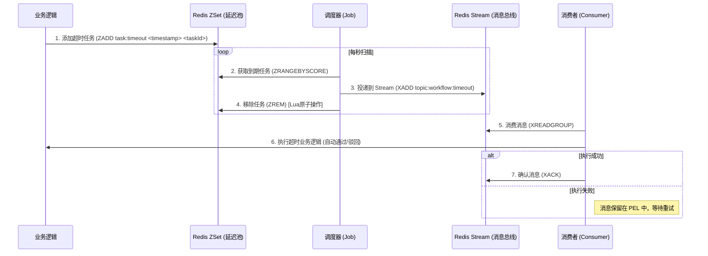

# CloudFlow Pro - Redis Stream 高可靠事件驱动架构设计

## 1. 概述
本设计文档旨在为 CloudFlow Pro 引入基于 **Redis 7.0 Stream** 的高可靠消息通信机制。
鉴于工作流服务中存在大量异步处理需求（如 SLA 超时处理、节点自动流转通知），我们需要一种比 Redis Pub/Sub 更可靠、比 RabbitMQ 更轻量的解决方案。

## 2. 核心架构：ZSet + Stream 混合模式
由于 Redis Stream 本身不支持“任意精度的延迟消息”（Delay Queue），针对 SLA 超时场景，我们采用 **ZSet (调度器) + Stream (执行器)** 的混合架构。

### 2.1 架构流程图

### 2.2 核心优势
1.  **可靠性 (Reliability):** 即使消费者宕机，消息仍在 Stream 的 PEL (Pending Entries List) 中，重启后可继续消费，彻底解决“取出即丢失”的问题。
2.  **解耦 (Decoupling):** 调度器只负责“触发”，具体的复杂业务逻辑（如级联更新数据库、发送通知）由消费者异步处理，避免调度线程阻塞。
3.  **流量削峰:** Stream 起到缓冲作用，防止瞬间大量任务超时压垮数据库。

## 3. 数据结构设计

### 3.1 Stream 定义
*   **Key:** `cloudflow:event:workflow`
*   **Field:**
    *   `type`: 事件类型 (`TIMEOUT`, `STATUS_CHANGE`, `URGE`)
    *   `payload`: JSON 格式的业务数据 (e.g., `{ "taskId": "123", "processId": "456" }`)
    *   `timestamp`: 产生时间

### 3.2 Consumer Group
*   **Group Name:** `group:workflow:engine`
*   **Consumer Name:** `consumer:${pod_ip}:${uuid}`

## 4. 关键机制实现

### 4.1 自动建组
应用启动时检查 Group 是否存在，不存在则自动创建 (`XGROUP CREATE ... MKSTREAM`)。

### 4.2 消息确认 (ACK)
消费者必须在业务逻辑完全执行成功后调用 `XACK`。若抛出异常，则不 ACK，依靠重试机制处理。

### 4.3 故障恢复 (Failover)
启动一个低频定时任务 (Rescuer)，扫描 PEL 中 `idle_time > 60s` 的消息，使用 `XCLAIM` 抢占并重新投递给活跃消费者。

### 4.4 内存管理
使用 `XADD ... MAXLEN ~ 100000` 策略，保留最近 10万条记录，防止 Redis 内存无限增长。

## 5. 监控指标
*   **Lag (堆积量):** `XINFO GROUPS` 查看 `lag` 字段。
*   **Pending (未确认量):** `XINFO GROUPS` 查看 `pending` 字段。若持续升高说明消费失败率高。
